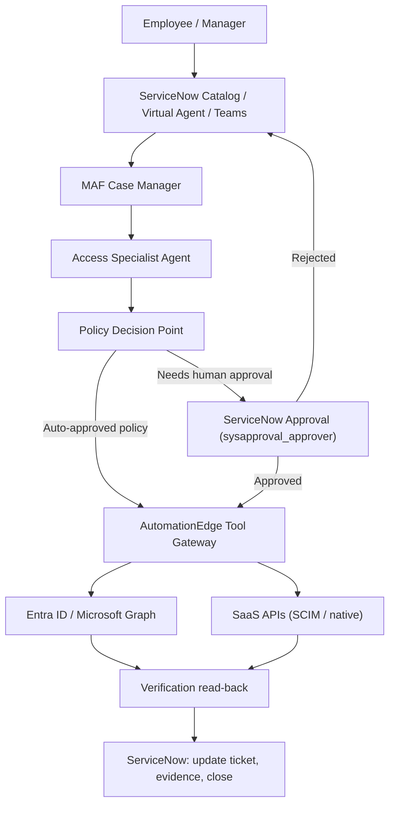
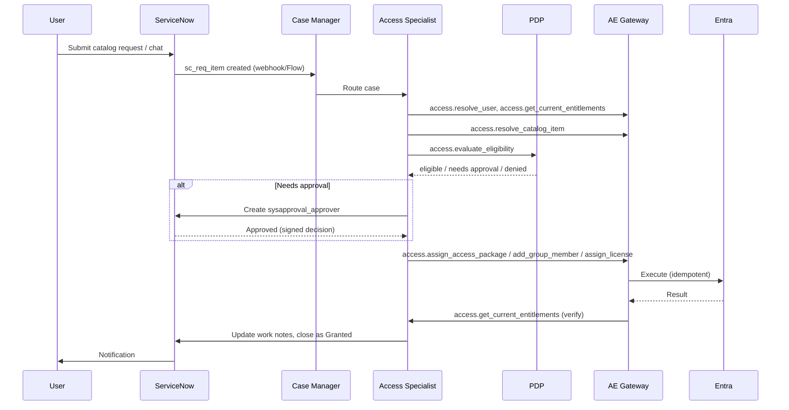

# Access Manager AI Coworker — Detailed Model Design
### Control plane: Microsoft Entra ID / Graph · Executor: AutomationEdge · ITSM: ServiceNow

**Scope:** AM‑01 Standard Access Provisioning, AM‑02 Deprovisioning/Offboarding, AM‑03 Access Reviews, AM‑04 License Reclamation

---

## 1. Purpose in one paragraph

The Access Manager is an AI coworker that *understands* access requests, *figures out* what should happen according to policy, and *asks AutomationEdge to do it*. It never touches Entra ID, Graph, or ServiceNow directly. Every decision it makes is checked against a policy engine, every risky action needs a human approval recorded in ServiceNow, and every completed action is re-verified before the case is closed. Think of it as a very well-trained analyst who fills out the ticket, checks the rulebook, and asks a manager to click "approve" — it never has the keys itself.

---

## 2. The five things that never change

These are the guardrails. Everything else in this document is built around them.

1. **The agent recommends, AutomationEdge executes.** No Graph/Entra/SaaS call is ever made by the LLM directly.
2. **No invented IDs.** Group IDs, role IDs, license SKUs, and approver chains come only from a lookup — never guessed by the model.
3. **Approval is a signed record, not a chat message.** A ServiceNow approval record (with approver, decision, scope, expiry) is required before any R2+ action runs.
4. **Every action is verified after the fact.** "The API returned success" is not the same as "the user now has access." A separate read-back confirms it.
5. **Everything is logged once, in one place.** ServiceNow is the single system of record for request → approval → execution → evidence → closure.

---

## 3. High-level architecture

**Why ServiceNow sits at both ends:** the request *starts* there (Catalog item or a ticket raised through Virtual Agent/Teams), and the outcome *lands* there (work notes, approval record, closure code). The AI and AutomationEdge are the engine in the middle — ServiceNow is where a human can always see what happened and why.

---

## 4. The four building blocks (roles)

| Block | What it actually does | What it is *not allowed* to do |
|---|---|---|
| **MAF Case Manager** | Reads the incoming request, figures out who the requester and target are, decides which specialist handles it, tracks the case state | Call Entra, Graph, SaaS APIs, or ServiceNow tables directly |
| **Access Specialist** | Matches the request to a real catalog item / group / role / license, explains eligibility, drafts the execution plan | Invent a group name, role ID, license SKU, or approver |
| **Policy Decision Point (PDP)** | A deterministic rules engine — not an LLM — that decides: auto-approve, needs approval, or deny | Accept an LLM's opinion as a policy decision |
| **AutomationEdge Tool Gateway** | The only component with real credentials; runs the actual Entra/Graph/SaaS/ServiceNow calls, retries safely, returns structured results | Let the LLM pass raw credentials, tokens, or arbitrary commands |

A simple way to explain it to a non-technical stakeholder:
> "The AI is the person who fills in the form correctly. The Policy engine is the rulebook. ServiceNow is the paper trail. AutomationEdge is the hands that actually flip the switch."

---

## 5. Core data objects (canonical model)

These are the objects every workflow below is built from. Keeping them consistent means AM‑01 through AM‑04 all speak the same language.

| Object | Key fields | ServiceNow equivalent |
|---|---|---|
| **Case** | case_id, requester, target_user, intent, status, created_at | `sc_request` (parent request) |
| **Access Request Item** | item_id, catalog_item, target_app/group/role, justification | `sc_req_item` |
| **Entitlement** | entitlement_id, type (group/app-role/license/access-package), friendly_name, tenant_object_id | Reference field on `sc_req_item`, mapped to a config table |
| **Approval** | approval_id, approver, decision, scope, expiry, plan_hash | `sysapproval_approver` |
| **Job** | job_id, tool_name, idempotency_key, status, evidence | Custom table `u_ae_job` (or work notes + attachment) |
| **Audit Record** | who, what, when, before/after state, AE job ref | `sc_req_item` work notes + `u_access_audit` table |

**Design decision:** maintain one internal **Entitlement Catalog** table that maps friendly names ("Salesforce – Sales Rep role") to immutable tenant-specific Entra/Graph IDs. Neither ServiceNow nor the LLM ever free-types an ID — they both reference this catalog.

---

## 6. ServiceNow integration specifics

| Need | ServiceNow mechanism |
|---|---|
| Intake a request | Service Catalog item ("Request Application Access", "Request Group Membership") → creates `sc_request` + `sc_req_item` |
| Conversational intake (Teams/chat) | Virtual Agent topic → creates the same catalog request behind the scenes, so there's one intake path regardless of channel |
| Track case state | `sc_req_item.stage` / custom state field driven by AutomationEdge callbacks |
| Human approval | `sysapproval_approver` record, linked to the request; approver acts via ServiceNow inbox, mobile app, or Teams approval card synced from ServiceNow |
| Orchestration trigger | Flow Designer subflow fires on `sc_req_item` insert/update → calls the AutomationEdge Tool Gateway via IntegrationHub REST step |
| Evidence / audit trail | Work notes (human-readable) + attachments (redacted diagnostic evidence) + a custom `u_access_audit` table (machine-readable, for reporting) |
| Access reviews | ServiceNow's own **Access Review / User Access Reviews** application (if licensed) or a custom `u_access_review_campaign` + `sysapproval_approver` per reviewer decision |
| Closure | `sc_req_item.state = Closed Complete/Incomplete` with a closure code (`granted`, `denied`, `partial`, `escalated`) |

**Key point to explain to stakeholders:** AutomationEdge talks to ServiceNow the same governed way it talks to Entra — through the ServiceNow REST Table API / IntegrationHub spoke, using a scoped service account, never through the LLM.

---

## 7. Risk tiers applied to Access Manager

| Tier | Access Manager examples | Who/what approves |
|---|---|---|
| **R0 – Read** | Look up current entitlements, check approval status, check license usage | Automatic |
| **R1 – Reversible, low impact** | Write an audit note, generate a recommendation report | Automatic |
| **R2 – User-impacting** | Add to a standard group, assign a standard license, provision a catalog app | Pre-approved catalog policy, or one manager approval in ServiceNow |
| **R3 – High privilege** | Privileged role assignment, access package with elevated scope, bulk license removal | Named approver + step-up auth + short-lived authorization, recorded in `sysapproval_approver` |
| **R4 – Never autonomous** | Directly disabling Conditional Access, bypassing SoD controls | Not exposed as an agent tool at all |

---

## 8. Workflow deep-dives

### AM‑01 — Standard Access Provisioning

**Trigger:** Employee (or manager on their behalf) submits a ServiceNow Catalog request, or asks via Teams/Virtual Agent ("I need access to Salesforce").

**Step-by-step in plain language:**
1. Resolve *who* is asking and *who* it's for (never guessed from free text — pulled from the authenticated session/HR record).
2. Resolve *what* they're asking for against the Entitlement Catalog (not a text match at execution time).
3. Check eligibility: job role, location, employment status, required training, device compliance (a signal only — Intune is not the access engine), license availability.
4. Look up the approval policy for that specific catalog item — some are pre-approved, some need a manager, some need an app owner.
5. If approval is needed, create it in ServiceNow and wait (checkpoint — the case can sit here for days without losing state).
6. Once approved (and the plan hasn't changed since — otherwise the approval is invalidated), provision via the approved mechanism: access package > Entra group > enterprise app role > direct SaaS API > RPA only if nothing else exists.
7. **Re-read** the entitlement to confirm it's actually there.
8. Write the audit trail and notify the user — all in the same ServiceNow ticket.

**What "good" looks like:** no duplicate group membership from a retried request, no second license consumed by accident, the ticket shows requester/target/reason/policy/approver/before-after state in one place.

---

### AM‑02 — Deprovisioning / Offboarding

**Trigger:** An authoritative HR termination/transfer event, or an approved ServiceNow offboarding request (never a casual chat message — this always starts from a system-of-record event).

**Ordered steps (order matters and is policy-driven, not agent-decided):**
1. Disable interactive sign-in and revoke active sessions.
2. Remove time-bound / temporary access grants first (they're the highest risk of being forgotten).
3. Remove direct group and role assignments.
4. Remove SaaS application entitlements (via SCIM/API where possible).
5. Transfer owned assets (shared mailbox ownership, Teams/SharePoint site ownership, app registrations) to a designated successor.
6. Reclaim licenses.
7. Verify removal by reading current state back.
8. Close the ServiceNow ticket with full evidence.

**Two hard fail-safes:**
- **Legal hold** and **service accounts** are excluded automatically and *fail closed* — meaning if the system can't confirm an account isn't under legal hold, it stops and escalates rather than proceeding.
- **Grace period** is policy-driven (e.g., mailbox access retained 30 days for a manager) — the agent doesn't decide this on its own judgment.

---

### AM‑03 — Access Reviews

**Trigger:** Scheduled campaign (e.g., quarterly review of a privileged group) or triggered by an access-review policy.

**Flow:**
1. Create or identify the review campaign and enumerate its scope (who is being reviewed, for what).
2. Notify reviewers — as ServiceNow tasks, each reviewer gets a task record they act on.
3. The AI *summarizes context* for each reviewer (last login, role changes, peer comparison) — this is genuinely useful and safe because it's informational, not a decision.
4. Collect signed decisions (`sysapproval_approver`-style records per reviewer/per user).
5. Send reminders for overdue reviewers automatically.
6. Apply **only** the approved (kept/revoked) decisions — the LLM never decides on its own whether someone keeps privileged access.
7. Verify the access change actually happened.
8. Generate an audit package (who was reviewed, who decided, what changed) attached to the campaign record in ServiceNow.

**Why this one is lower-risk to automate the "coordination" of, but not the "decision":** the value of AI here is chasing down reviewers and summarizing evidence — genuinely tedious human work — while the actual "should this person keep access" judgment always stays human.

---

### AM‑04 — License Reclamation

**Trigger:** Scheduled AE workflow (e.g., monthly) — not a chat request.

**Flow:**
1. Pull SKU assignments, application activity, employment/leave status, and any business-critical exceptions.
2. Apply a minimum-inactivity threshold (policy-configured, e.g., 60 days no login).
3. **Generate a recommendation first** — this is the key design choice. The agent never removes a license on its own judgment call.
4. The recommendation goes to ServiceNow as a request needing catalog policy approval (some low-risk reclamations can be pre-approved by policy; anything ambiguous needs a human).
5. On approval, remove the license.
6. **Verify** the license count changed as expected.
7. Preserve the activity snapshot used to make the recommendation (so if someone disputes it later, there's evidence, not just "the AI said so").

**Important caveat to flag to stakeholders:** Microsoft 365 usage reports are not a reliable activity signal for every SKU — some SaaS apps need their own usage API. The reclamation logic must be app-aware, not a single blanket rule.

---

## 9. Access Manager tool catalog

| Tool ID | AutomationEdge workflow | Talks to | Mode | Risk |
|---|---|---|---|---:|
| `access.resolve_user` | `AE_ACC_001_ResolveUser` | Entra / HR / ServiceNow | Read | R0 |
| `access.get_current_entitlements` | `AE_ACC_002_GetEntitlements` | Graph / SaaS | Read | R0 |
| `access.resolve_catalog_item` | `AE_ACC_003_ResolveCatalog` | Entitlement Catalog | Read | R0 |
| `access.evaluate_eligibility` | `AE_ACC_004_EvaluateEligibility` | Policy engine | Read/decision | R0 |
| `access.get_approval_chain` | `AE_ACC_005_GetApprovalChain` | ServiceNow / catalog | Read | R0 |
| `access.get_approval_status` | `AE_ACC_006_GetApprovalStatus` | ServiceNow (`sysapproval_approver`) | Read | R0 |
| `access.assign_access_package` | `AE_ACC_010_AssignAccessPackage` | Entra entitlement mgmt | Execute | R2/R3 |
| `access.add_group_member` | `AE_ACC_011_AddGroupMember` | Microsoft Graph | Execute | R2/R3 |
| `access.assign_app_role` | `AE_ACC_012_AssignAppRole` | Entra enterprise app | Execute | R2/R3 |
| `access.assign_license` | `AE_ACC_013_AssignLicense` | Graph / SaaS | Execute | R2 |
| `access.provision_saas_user` | `AE_ACC_014_ProvisionSaaS` | SCIM / API / RPA | Execute | R2/R3 |
| `access.remove_entitlement` | `AE_ACC_020_RemoveEntitlement` | Graph / SaaS | Execute | R2/R3 |
| `access.revoke_sessions` | `AE_ACC_021_RevokeSessions` | Entra / SaaS | Execute | R3 |
| `access.create_review` | `AE_ACC_030_CreateAccessReview` | Entra governance / ServiceNow | Execute | R2 |
| `access.apply_review_decisions` | `AE_ACC_031_ApplyReviewDecisions` | Entra / SaaS | Execute | R3 |
| `access.get_license_usage` | `AE_ACC_040_GetLicenseUsage` | Graph / SaaS reports | Read | R0 |
| `access.reclaim_license` | `AE_ACC_041_ReclaimLicense` | Graph / SaaS | Execute | R2/R3 |
| `servicenow.create_request` | `AE_SNOW_001_CreateRequest` | ServiceNow Table API | Write | R1 |
| `servicenow.create_approval` | `AE_SNOW_002_CreateApproval` | ServiceNow Table API | Write | R1 |
| `servicenow.update_ticket` | `AE_SNOW_003_UpdateTicket` | ServiceNow Table API | Write | R1 |
| `servicenow.write_audit_evidence` | `AE_SNOW_004_WriteAuditEvidence` | ServiceNow Table API | Write | R1 |

---

## 10. What "done and safe" looks like (success criteria)

- The right person got the right access — no fuzzy-matched target user, ever.
- What was approved is exactly what was executed (approval scope = plan scope; if the plan changes, the approval is voided and re-requested).
- A resubmitted/duplicate request does not create a duplicate group membership or burn a second license (idempotency).
- Offboarding never touches a legal-hold or service account without explicit override.
- Every ServiceNow ticket, on its own, tells the full story: requester, target, reason, policy applied, approver, AutomationEdge job reference, before/after state, timestamp, outcome.

---

## 11. Failure handling (what happens when things go sideways)

| Situation | Behavior |
|---|---|
| AutomationEdge call times out | Treated as `unknown`, never `failed` — re-check actual state in Entra before deciding what to do next |
| ServiceNow approval expires before execution | Plan is invalidated; requires fresh approval |
| Same request submitted twice | Idempotency key returns the original result, no duplicate action |
| Graph API throttled (429) | Bounded automatic retry on reads; writes retried only if idempotency is guaranteed |
| Policy says deny but confidence/urgency is high | Policy always wins — there is no "override by AI judgment" |
| SaaS app has no API/SCIM | Falls back to credential-vaulted RPA, evidence captured as screenshots, and the case is flagged with lower confidence |

---

## 12. Rollout plan (Access Manager only)

| Phase | What ships | Exit criteria |
|---|---|---|
| **1 — Read-only copilot** | `access.resolve_user`, `get_current_entitlements`, `get_approval_status`, `get_license_usage`; agent explains eligibility but executes nothing | Agent produces correct, evidence-backed answers with no wrong-target errors |
| **2 — Low-risk provisioning** | AM‑01 for standard/pre-approved catalog items only (`add_group_member`, `assign_license` via policy, not manual approval) | ≥90% verified success in pilot group |
| **3 — Governed lifecycle** | AM‑02 offboarding, AM‑03 access reviews, AM‑04 license reclamation, R3 actions with named approvers | Full audit trail, SLA/rollback controls proven in production |
| **4 — Optimization** | Trend analysis (which apps get requested most, which licenses go stale), proactive reclamation campaigns | Savings measured against reclaimed licenses / reduced manual ticket volume |

---

## 13. One-paragraph summary for a leadership audience

> The Access Manager doesn't get any new authority that a human didn't already have — it just does the tedious parts (looking things up, filling in the right IDs, drafting the ticket, chasing approvals, double-checking the result) faster and more consistently. ServiceNow remains exactly what it is today: the system where every access decision is requested, approved, and recorded. AutomationEdge remains the only thing with real credentials. The AI's job is to make sure the right ticket, with the right facts, reaches the right approver — and that nothing executes until it's actually approved.
