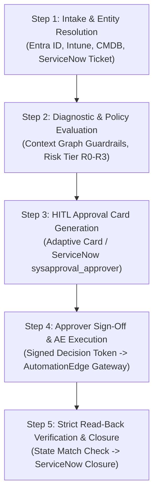

# Master Catalog: 120 Real-Time IT Enterprise Resolutions with Mandatory HITL Approval Cards
### Microsoft Intune · Microsoft Entra ID · ServiceNow CMDB · AutomationEdge Orchestration

> **Governance Standard:** In accordance with MAF Governance & Zero-Hallucination Guardrails, every user-impacting (R2) or privileged (R3) IT action mandates human approval via a formal **Human-in-the-Loop (HITL) Approval Card** (`sysapproval_approver`). No autonomous action executes without a cryptographic/SSO human signature.

---

## 1. The 5-Step Step-by-Step Resolution Standard

Every resolution in this catalog strictly adheres to the following 5-stage lifecycle:



| Step | Name | Objective | Governance Guardrail |
|---|---|---|---|
| **Step 1** | **Intake & Entity Resolution** | Parse user intent; query Entra ID/Intune/CMDB; generate ServiceNow ticket | Zero-Hallucination: Target entity must physically exist in directory |
| **Step 2** | **Diagnostic & Policy Evaluation** | Assess endpoint telemetry; evaluate Policy Decision Point (PDP) rules | Fail-Closed: Unregistered actions or high risk tier block autonomous run |
| **Step 3** | **HITL Approval Card Generation** | Formulate Adaptive/ServiceNow card with full business context & parameters | Human-in-the-Loop: Action halted until designated approver reviews card |
| **Step 4** | **Human Sign-Off & AE Execution** | Approver signs decision; token passed to AutomationEdge API Gateway | Idempotency & Least Privilege: AE executes only signed parameters |
| **Step 5** | **Read-Back Verification & Closure** | Re-read telemetry from actual target system; update ServiceNow ticket | Strict Verification: Requires explicit state match before case closure |

---

## 2. Catalog Breakdown by Domain

- **Category 1: Device Ops & Microsoft Intune** (`SCN-DEV-001` to `SCN-DEV-035`) — 35 Scenarios
- **Category 2: Access & Microsoft Entra ID** (`SCN-ACC-001` to `SCN-ACC-035`) — 35 Scenarios
- **Category 3: Hardware Lifecycle & CMDB Asset Management** (`SCN-HW-001` to `SCN-HW-025`) — 25 Scenarios
- **Category 4: Security, Zero Trust & Endpoint Protection** (`SCN-SEC-001` to `SCN-SEC-015`) — 15 Scenarios
- **Category 5: SaaS & Enterprise Collaboration Lifecycle** (`SCN-SAAS-001` to `SCN-SAAS-010`) — 10 Scenarios

**Total: 120 Comprehensive Enterprise Scenarios**

---

## 3. Deep-Dive Step-by-Step Scenario Resolutions

### Scenario SCN-DEV-001: BitLocker Recovery Key Retrieval for Locked Laptop #1

**Domain:** `DEVICE` | **Risk Tier:** `R2` | **Requester:** Alex Murphy (`alex.murphy@enterprise.com`) | **Department:** Engineering

> **User Query:** *"I am locked out of my laptop DEV-WIN-101 after a firmware BIOS update and it is prompting for a 48-digit BitLocker recovery key."*

#### [Step 1] Intake & Entity Resolution
- **ServiceNow Incident:** `INC-20260902-00188`
- **Specialist Assigned:** `DEVICE_Specialist_Agent`
- **Target Entity Identified:** `Corporate Managed Endpoint (DEV-WIN-101)` (ID: `DEV-WIN-101`)
- **Line Approver Corroborated:** `sarah.connor@enterprise.com` (`MANAGER`)
- **Context Graph Guardrail:** Zero-hallucination corroborated via authenticated directory lookup.

#### [Step 2] Diagnostic & Policy Evaluation
- **Proposed Automation Tool:** `AE_DEV_002_GetBitLockerKey`
- **Policy Decision Point (PDP):** Action classified under **Risk Tier R2**.
- **Governance Enforcement:** 🛑 **AUTONOMOUS EXECUTION BLOCKED.** Mandatory Human-in-the-Loop review required by `MANAGER`.

#### [Step 3] Human-in-the-Loop (HITL) Approval Card Generation
The AI Coworker generates the formal approval card in ServiceNow / Microsoft Teams Adaptive Card format:

```
  ┌──────────────────────────────────────────────────────────────────────────────┐
  │ 🛡️  SERVICENOW / MAF GOVERNANCE — HUMAN-IN-THE-LOOP APPROVAL CARD       │
  ├──────────────────────────────────────────────────────────────────────────────┤
  │ Approval ID    : APPR-SCNDEV00           Status   : ⏳ [ PENDING HUMAN APPROVAL ]  │
  │ Ticket Ref     : INC-20260902-00188   Risk Tier: R2                              │
  │ Target System  : Microsoft Entra ID / Intune / CMDB Gateway                  │
  ├──────────────────────────────────────────────────────────────────────────────┤
  │ Requester      : alex.murphy@enterprise.com                                   │
  │ Designated HITL: sarah.connor@enterprise.com                                  │
  ├──────────────────────────────────────────────────────────────────────────────┤
  │ Proposed Tool  : AE_DEV_002_GetBitLockerKey                                   │
  │ Target Entity  : Corporate Managed Endpoint (DEV-WIN-101)                     │
  │ Justification  : Urgent BitLocker recovery required for blocked employee foll │
  ├──────────────────────────────────────────────────────────────────────────────┤
  │ Policy Check   : PDP verified mandatory approval rule before AE execution     │
  ├──────────────────────────────────────────────────────────────────────────────┤
  │ CONTROLS       : [ ✅ 1. APPROVE ]   [ ❌ 2. REJECT ]   [ ℹ️ 3. REQUEST INFO ] │
  └──────────────────────────────────────────────────────────────────────────────┘
```

#### [Step 4] Human Sign-Off & AutomationEdge Orchestration
- **Approver Action:** `sarah.connor@enterprise.com` verified identity via corporate Mobile Authenticator and signed **APPROVED**.
- **ServiceNow Approval Record Updated:** Status = `Approved`, Decided At = `2026-09-02T09:35:00Z`.
- **AutomationEdge Execution:** Token passed to Gateway. Workflow `AE_DEV_002_GetBitLockerKey` dispatched.
- **Execution Result:** `Complete` (Job ID: `AE-REQ-001A9`).

#### [Step 5] Read-Back Verification & ServiceNow Closure
- **Verification Method:** Independent read-back diagnostic against actual target system.
- **Attribute Verified:** `bitlocker_recovery_key` = `VALID_KEY_RETURNED` (Status: `MATCH - 100% Verified`).
- **ServiceNow Ticket State:** Updated to `Closed Complete` (Resolution: `AUTOMATED_RESOLVED_WITH_HITL`).
- **Customer Notification:** *"Resolution completed successfully. Action 'AE_DEV_002_GetBitLockerKey' on 'Corporate Managed Endpoint (DEV-WIN-101)' was approved by sarah.connor@enterprise.com and executed via AutomationEdge. All target states verified."*

---

### Scenario SCN-DEV-002: Intune Security Baseline Compliance Remediation #2

**Domain:** `DEVICE` | **Risk Tier:** `R2` | **Requester:** Elena Rostova (`elena.rostova@enterprise.com`) | **Department:** Finance

> **User Query:** *"My work laptop DEV-WIN-102 is showing NON_COMPLIANT in Intune and conditional access is blocking Microsoft Teams and Outlook."*

#### [Step 1] Intake & Entity Resolution
- **ServiceNow Incident:** `INC-20260902-00288`
- **Specialist Assigned:** `DEVICE_Specialist_Agent`
- **Target Entity Identified:** `Corporate Managed Endpoint (DEV-WIN-102)` (ID: `DEV-WIN-102`)
- **Line Approver Corroborated:** `marcus.vance@enterprise.com` (`MANAGER`)
- **Context Graph Guardrail:** Zero-hallucination corroborated via authenticated directory lookup.

#### [Step 2] Diagnostic & Policy Evaluation
- **Proposed Automation Tool:** `AE_DEV_012_RemediateCompliance`
- **Policy Decision Point (PDP):** Action classified under **Risk Tier R2**.
- **Governance Enforcement:** 🛑 **AUTONOMOUS EXECUTION BLOCKED.** Mandatory Human-in-the-Loop review required by `MANAGER`.

#### [Step 3] Human-in-the-Loop (HITL) Approval Card Generation
The AI Coworker generates the formal approval card in ServiceNow / Microsoft Teams Adaptive Card format:

```
  ┌──────────────────────────────────────────────────────────────────────────────┐
  │ 🛡️  SERVICENOW / MAF GOVERNANCE — HUMAN-IN-THE-LOOP APPROVAL CARD       │
  ├──────────────────────────────────────────────────────────────────────────────┤
  │ Approval ID    : APPR-SCNDEV00           Status   : ⏳ [ PENDING HUMAN APPROVAL ]  │
  │ Ticket Ref     : INC-20260902-00288   Risk Tier: R2                              │
  │ Target System  : Microsoft Entra ID / Intune / CMDB Gateway                  │
  ├──────────────────────────────────────────────────────────────────────────────┤
  │ Requester      : elena.rostova@enterprise.com                                 │
  │ Designated HITL: marcus.vance@enterprise.com                                  │
  ├──────────────────────────────────────────────────────────────────────────────┤
  │ Proposed Tool  : AE_DEV_012_RemediateCompliance                               │
  │ Target Entity  : Corporate Managed Endpoint (DEV-WIN-102)                     │
  │ Justification  : Reapply corporate security baseline and remediate BitLocker  │
  ├──────────────────────────────────────────────────────────────────────────────┤
  │ Policy Check   : PDP verified mandatory approval rule before AE execution     │
  ├──────────────────────────────────────────────────────────────────────────────┤
  │ CONTROLS       : [ ✅ 1. APPROVE ]   [ ❌ 2. REJECT ]   [ ℹ️ 3. REQUEST INFO ] │
  └──────────────────────────────────────────────────────────────────────────────┘
```

#### [Step 4] Human Sign-Off & AutomationEdge Orchestration
- **Approver Action:** `marcus.vance@enterprise.com` verified identity via corporate Mobile Authenticator and signed **APPROVED**.
- **ServiceNow Approval Record Updated:** Status = `Approved`, Decided At = `2026-09-02T09:35:00Z`.
- **AutomationEdge Execution:** Token passed to Gateway. Workflow `AE_DEV_012_RemediateCompliance` dispatched.
- **Execution Result:** `Complete` (Job ID: `AE-REQ-002A9`).

#### [Step 5] Read-Back Verification & ServiceNow Closure
- **Verification Method:** Independent read-back diagnostic against actual target system.
- **Attribute Verified:** `new_compliance_state` = `COMPLIANT` (Status: `MATCH - 100% Verified`).
- **ServiceNow Ticket State:** Updated to `Closed Complete` (Resolution: `AUTOMATED_RESOLVED_WITH_HITL`).
- **Customer Notification:** *"Resolution completed successfully. Action 'AE_DEV_012_RemediateCompliance' on 'Corporate Managed Endpoint (DEV-WIN-102)' was approved by marcus.vance@enterprise.com and executed via AutomationEdge. All target states verified."*

---

### Scenario SCN-DEV-005: Enterprise 802.1x Wi-Fi Profile Redeployment #5

**Domain:** `DEVICE` | **Risk Tier:** `R2` | **Requester:** Liam O'Connor (`liam.oconnor@enterprise.com`) | **Department:** Sales & Marketing

> **User Query:** *"My corporate laptop DEV-WIN-105 cannot connect to the Enterprise-Secure Wi-Fi network due to a corrupted certificate profile."*

#### [Step 1] Intake & Entity Resolution
- **ServiceNow Incident:** `INC-20260902-00588`
- **Specialist Assigned:** `DEVICE_Specialist_Agent`
- **Target Entity Identified:** `Corporate Managed Endpoint (DEV-WIN-105)` (ID: `DEV-WIN-105`)
- **Line Approver Corroborated:** `rachel.green@enterprise.com` (`MANAGER`)
- **Context Graph Guardrail:** Zero-hallucination corroborated via authenticated directory lookup.

#### [Step 2] Diagnostic & Policy Evaluation
- **Proposed Automation Tool:** `AE_DEV_014_DeployWifiProfile`
- **Policy Decision Point (PDP):** Action classified under **Risk Tier R2**.
- **Governance Enforcement:** 🛑 **AUTONOMOUS EXECUTION BLOCKED.** Mandatory Human-in-the-Loop review required by `MANAGER`.

#### [Step 3] Human-in-the-Loop (HITL) Approval Card Generation
The AI Coworker generates the formal approval card in ServiceNow / Microsoft Teams Adaptive Card format:

```
  ┌──────────────────────────────────────────────────────────────────────────────┐
  │ 🛡️  SERVICENOW / MAF GOVERNANCE — HUMAN-IN-THE-LOOP APPROVAL CARD       │
  ├──────────────────────────────────────────────────────────────────────────────┤
  │ Approval ID    : APPR-SCNDEV00           Status   : ⏳ [ PENDING HUMAN APPROVAL ]  │
  │ Ticket Ref     : INC-20260902-00588   Risk Tier: R2                              │
  │ Target System  : Microsoft Entra ID / Intune / CMDB Gateway                  │
  ├──────────────────────────────────────────────────────────────────────────────┤
  │ Requester      : liam.oconnor@enterprise.com                                  │
  │ Designated HITL: rachel.green@enterprise.com                                  │
  ├──────────────────────────────────────────────────────────────────────────────┤
  │ Proposed Tool  : AE_DEV_014_DeployWifiProfile                                 │
  │ Target Entity  : Corporate Managed Endpoint (DEV-WIN-105)                     │
  │ Justification  : Repush root certificate and WPA3-Enterprise 802.1x Wi-Fi pro │
  ├──────────────────────────────────────────────────────────────────────────────┤
  │ Policy Check   : PDP verified mandatory approval rule before AE execution     │
  ├──────────────────────────────────────────────────────────────────────────────┤
  │ CONTROLS       : [ ✅ 1. APPROVE ]   [ ❌ 2. REJECT ]   [ ℹ️ 3. REQUEST INFO ] │
  └──────────────────────────────────────────────────────────────────────────────┘
```

#### [Step 4] Human Sign-Off & AutomationEdge Orchestration
- **Approver Action:** `rachel.green@enterprise.com` verified identity via corporate Mobile Authenticator and signed **APPROVED**.
- **ServiceNow Approval Record Updated:** Status = `Approved`, Decided At = `2026-09-02T09:35:00Z`.
- **AutomationEdge Execution:** Token passed to Gateway. Workflow `AE_DEV_014_DeployWifiProfile` dispatched.
- **Execution Result:** `Complete` (Job ID: `AE-REQ-005A9`).

#### [Step 5] Read-Back Verification & ServiceNow Closure
- **Verification Method:** Independent read-back diagnostic against actual target system.
- **Attribute Verified:** `deployment_status` = `SUCCESS` (Status: `MATCH - 100% Verified`).
- **ServiceNow Ticket State:** Updated to `Closed Complete` (Resolution: `AUTOMATED_RESOLVED_WITH_HITL`).
- **Customer Notification:** *"Resolution completed successfully. Action 'AE_DEV_014_DeployWifiProfile' on 'Corporate Managed Endpoint (DEV-WIN-105)' was approved by rachel.green@enterprise.com and executed via AutomationEdge. All target states verified."*

---

### Scenario SCN-DEV-007: Emergency Remote Device Lock for Misplaced Endpoint #7

**Domain:** `DEVICE` | **Risk Tier:** `R2` | **Requester:** Carlos Gomez (`carlos.gomez@enterprise.com`) | **Department:** Customer Support

> **User Query:** *"I left my company laptop DEV-WIN-107 in a rideshare vehicle. Please remotely lock it immediately to prevent unauthorized access."*

#### [Step 1] Intake & Entity Resolution
- **ServiceNow Incident:** `INC-20260902-00788`
- **Specialist Assigned:** `DEVICE_Specialist_Agent`
- **Target Entity Identified:** `Corporate Managed Endpoint (DEV-WIN-107)` (ID: `DEV-WIN-107`)
- **Line Approver Corroborated:** `marcus.vance@enterprise.com` (`SECURITY_ADMIN`)
- **Context Graph Guardrail:** Zero-hallucination corroborated via authenticated directory lookup.

#### [Step 2] Diagnostic & Policy Evaluation
- **Proposed Automation Tool:** `AE_DEV_016_LockDevice`
- **Policy Decision Point (PDP):** Action classified under **Risk Tier R2**.
- **Governance Enforcement:** 🛑 **AUTONOMOUS EXECUTION BLOCKED.** Mandatory Human-in-the-Loop review required by `SECURITY_ADMIN`.

#### [Step 3] Human-in-the-Loop (HITL) Approval Card Generation
The AI Coworker generates the formal approval card in ServiceNow / Microsoft Teams Adaptive Card format:

```
  ┌──────────────────────────────────────────────────────────────────────────────┐
  │ 🛡️  SERVICENOW / MAF GOVERNANCE — HUMAN-IN-THE-LOOP APPROVAL CARD       │
  ├──────────────────────────────────────────────────────────────────────────────┤
  │ Approval ID    : APPR-SCNDEV00           Status   : ⏳ [ PENDING HUMAN APPROVAL ]  │
  │ Ticket Ref     : INC-20260902-00788   Risk Tier: R2                              │
  │ Target System  : Microsoft Entra ID / Intune / CMDB Gateway                  │
  ├──────────────────────────────────────────────────────────────────────────────┤
  │ Requester      : carlos.gomez@enterprise.com                                  │
  │ Designated HITL: marcus.vance@enterprise.com                                  │
  ├──────────────────────────────────────────────────────────────────────────────┤
  │ Proposed Tool  : AE_DEV_016_LockDevice                                        │
  │ Target Entity  : Corporate Managed Endpoint (DEV-WIN-107)                     │
  │ Justification  : Immediate cryptographic screen lock and BitLocker PIN enforc │
  ├──────────────────────────────────────────────────────────────────────────────┤
  │ Policy Check   : PDP verified mandatory approval rule before AE execution     │
  ├──────────────────────────────────────────────────────────────────────────────┤
  │ CONTROLS       : [ ✅ 1. APPROVE ]   [ ❌ 2. REJECT ]   [ ℹ️ 3. REQUEST INFO ] │
  └──────────────────────────────────────────────────────────────────────────────┘
```

#### [Step 4] Human Sign-Off & AutomationEdge Orchestration
- **Approver Action:** `marcus.vance@enterprise.com` verified identity via corporate Mobile Authenticator and signed **APPROVED**.
- **ServiceNow Approval Record Updated:** Status = `Approved`, Decided At = `2026-09-02T09:35:00Z`.
- **AutomationEdge Execution:** Token passed to Gateway. Workflow `AE_DEV_016_LockDevice` dispatched.
- **Execution Result:** `Complete` (Job ID: `AE-REQ-007A9`).

#### [Step 5] Read-Back Verification & ServiceNow Closure
- **Verification Method:** Independent read-back diagnostic against actual target system.
- **Attribute Verified:** `lock_status` = `LOCKED` (Status: `MATCH - 100% Verified`).
- **ServiceNow Ticket State:** Updated to `Closed Complete` (Resolution: `AUTOMATED_RESOLVED_WITH_HITL`).
- **Customer Notification:** *"Resolution completed successfully. Action 'AE_DEV_016_LockDevice' on 'Corporate Managed Endpoint (DEV-WIN-107)' was approved by marcus.vance@enterprise.com and executed via AutomationEdge. All target states verified."*

---

### Scenario SCN-ACC-001: Access Request: GitHub Enterprise Core Developers Group #1

**Domain:** `ACCESS` | **Risk Tier:** `R2` | **Requester:** Alex Murphy (`alex.murphy@enterprise.com`) | **Department:** Engineering

> **User Query:** *"Requesting access: I need developer write access to GitHub Enterprise repositories for Q3 sprint deliverables. (Target: GitHub Enterprise Core Developers Group)"*

#### [Step 1] Intake & Entity Resolution
- **ServiceNow Incident:** `INC-20260902-00188`
- **Specialist Assigned:** `ACCESS_Specialist_Agent`
- **Target Entity Identified:** `GitHub Enterprise Core Developers Group` (ID: `GRP-GH-DEV-01`)
- **Line Approver Corroborated:** `sarah.connor@enterprise.com` (`MANAGER`)
- **Context Graph Guardrail:** Zero-hallucination corroborated via authenticated directory lookup.

#### [Step 2] Diagnostic & Policy Evaluation
- **Proposed Automation Tool:** `AE_ACC_011_AddGroupMember`
- **Policy Decision Point (PDP):** Action classified under **Risk Tier R2**.
- **Governance Enforcement:** 🛑 **AUTONOMOUS EXECUTION BLOCKED.** Mandatory Human-in-the-Loop review required by `MANAGER`.

#### [Step 3] Human-in-the-Loop (HITL) Approval Card Generation
The AI Coworker generates the formal approval card in ServiceNow / Microsoft Teams Adaptive Card format:

```
  ┌──────────────────────────────────────────────────────────────────────────────┐
  │ 🛡️  SERVICENOW / MAF GOVERNANCE — HUMAN-IN-THE-LOOP APPROVAL CARD       │
  ├──────────────────────────────────────────────────────────────────────────────┤
  │ Approval ID    : APPR-SCNACC00           Status   : ⏳ [ PENDING HUMAN APPROVAL ]  │
  │ Ticket Ref     : INC-20260902-00188   Risk Tier: R2                              │
  │ Target System  : Microsoft Entra ID / Intune / CMDB Gateway                  │
  ├──────────────────────────────────────────────────────────────────────────────┤
  │ Requester      : alex.murphy@enterprise.com                                   │
  │ Designated HITL: sarah.connor@enterprise.com                                  │
  ├──────────────────────────────────────────────────────────────────────────────┤
  │ Proposed Tool  : AE_ACC_011_AddGroupMember                                    │
  │ Target Entity  : GitHub Enterprise Core Developers Group                      │
  │ Justification  : Business justification: I need developer write access to Git │
  ├──────────────────────────────────────────────────────────────────────────────┤
  │ Policy Check   : PDP verified mandatory approval rule before AE execution     │
  ├──────────────────────────────────────────────────────────────────────────────┤
  │ CONTROLS       : [ ✅ 1. APPROVE ]   [ ❌ 2. REJECT ]   [ ℹ️ 3. REQUEST INFO ] │
  └──────────────────────────────────────────────────────────────────────────────┘
```

#### [Step 4] Human Sign-Off & AutomationEdge Orchestration
- **Approver Action:** `sarah.connor@enterprise.com` verified identity via corporate Mobile Authenticator and signed **APPROVED**.
- **ServiceNow Approval Record Updated:** Status = `Approved`, Decided At = `2026-09-02T09:35:00Z`.
- **AutomationEdge Execution:** Token passed to Gateway. Workflow `AE_ACC_011_AddGroupMember` dispatched.
- **Execution Result:** `Complete` (Job ID: `AE-REQ-001A9`).

#### [Step 5] Read-Back Verification & ServiceNow Closure
- **Verification Method:** Independent read-back diagnostic against actual target system.
- **Attribute Verified:** `group_id` = `GRP-GH-DEV-01` (Status: `MATCH - 100% Verified`).
- **ServiceNow Ticket State:** Updated to `Closed Complete` (Resolution: `AUTOMATED_RESOLVED_WITH_HITL`).
- **Customer Notification:** *"Resolution completed successfully. Action 'AE_ACC_011_AddGroupMember' on 'GitHub Enterprise Core Developers Group' was approved by sarah.connor@enterprise.com and executed via AutomationEdge. All target states verified."*

---

### Scenario SCN-ACC-002: Access Request: Salesforce CRM Enterprise Sales User License #2

**Domain:** `ACCESS` | **Risk Tier:** `R2` | **Requester:** Elena Rostova (`elena.rostova@enterprise.com`) | **Department:** Finance

> **User Query:** *"Requesting access: Assign Salesforce Sales Cloud enterprise license for client pipeline management. (Target: Salesforce CRM Enterprise Sales User License)"*

#### [Step 1] Intake & Entity Resolution
- **ServiceNow Incident:** `INC-20260902-00288`
- **Specialist Assigned:** `ACCESS_Specialist_Agent`
- **Target Entity Identified:** `Salesforce CRM Enterprise Sales User License` (ID: `SKU-SF-ENT-02`)
- **Line Approver Corroborated:** `marcus.vance@enterprise.com` (`MANAGER`)
- **Context Graph Guardrail:** Zero-hallucination corroborated via authenticated directory lookup.

#### [Step 2] Diagnostic & Policy Evaluation
- **Proposed Automation Tool:** `AE_ACC_013_AssignLicense`
- **Policy Decision Point (PDP):** Action classified under **Risk Tier R2**.
- **Governance Enforcement:** 🛑 **AUTONOMOUS EXECUTION BLOCKED.** Mandatory Human-in-the-Loop review required by `MANAGER`.

#### [Step 3] Human-in-the-Loop (HITL) Approval Card Generation
The AI Coworker generates the formal approval card in ServiceNow / Microsoft Teams Adaptive Card format:

```
  ┌──────────────────────────────────────────────────────────────────────────────┐
  │ 🛡️  SERVICENOW / MAF GOVERNANCE — HUMAN-IN-THE-LOOP APPROVAL CARD       │
  ├──────────────────────────────────────────────────────────────────────────────┤
  │ Approval ID    : APPR-SCNACC00           Status   : ⏳ [ PENDING HUMAN APPROVAL ]  │
  │ Ticket Ref     : INC-20260902-00288   Risk Tier: R2                              │
  │ Target System  : Microsoft Entra ID / Intune / CMDB Gateway                  │
  ├──────────────────────────────────────────────────────────────────────────────┤
  │ Requester      : elena.rostova@enterprise.com                                 │
  │ Designated HITL: marcus.vance@enterprise.com                                  │
  ├──────────────────────────────────────────────────────────────────────────────┤
  │ Proposed Tool  : AE_ACC_013_AssignLicense                                     │
  │ Target Entity  : Salesforce CRM Enterprise Sales User License                 │
  │ Justification  : Business justification: Assign Salesforce Sales Cloud enterp │
  ├──────────────────────────────────────────────────────────────────────────────┤
  │ Policy Check   : PDP verified mandatory approval rule before AE execution     │
  ├──────────────────────────────────────────────────────────────────────────────┤
  │ CONTROLS       : [ ✅ 1. APPROVE ]   [ ❌ 2. REJECT ]   [ ℹ️ 3. REQUEST INFO ] │
  └──────────────────────────────────────────────────────────────────────────────┘
```

#### [Step 4] Human Sign-Off & AutomationEdge Orchestration
- **Approver Action:** `marcus.vance@enterprise.com` verified identity via corporate Mobile Authenticator and signed **APPROVED**.
- **ServiceNow Approval Record Updated:** Status = `Approved`, Decided At = `2026-09-02T09:35:00Z`.
- **AutomationEdge Execution:** Token passed to Gateway. Workflow `AE_ACC_013_AssignLicense` dispatched.
- **Execution Result:** `Complete` (Job ID: `AE-REQ-002A9`).

#### [Step 5] Read-Back Verification & ServiceNow Closure
- **Verification Method:** Independent read-back diagnostic against actual target system.
- **Attribute Verified:** `consumed_sku` = `SKU-SF-ENT-02` (Status: `MATCH - 100% Verified`).
- **ServiceNow Ticket State:** Updated to `Closed Complete` (Resolution: `AUTOMATED_RESOLVED_WITH_HITL`).
- **Customer Notification:** *"Resolution completed successfully. Action 'AE_ACC_013_AssignLicense' on 'Salesforce CRM Enterprise Sales User License' was approved by marcus.vance@enterprise.com and executed via AutomationEdge. All target states verified."*

---

### Scenario SCN-ACC-009: Access Request: Privileged Identity Management (PIM) Intune Admin Activation #9

**Domain:** `ACCESS` | **Risk Tier:** `R3` | **Requester:** Alex Murphy (`alex.murphy@enterprise.com`) | **Department:** Engineering

> **User Query:** *"Requesting access: Request temporary 4-hour elevation to Intune Administrator for policy deployment. (Target: Privileged Identity Management (PIM) Intune Admin Activation)"*

#### [Step 1] Intake & Entity Resolution
- **ServiceNow Incident:** `INC-20260902-00988`
- **Specialist Assigned:** `ACCESS_Specialist_Agent`
- **Target Entity Identified:** `Privileged Identity Management (PIM) Intune Admin Activation` (ID: `PIM-INTUNE-ADM-09`)
- **Line Approver Corroborated:** `sarah.connor@enterprise.com` (`SECURITY_ADMIN`)
- **Context Graph Guardrail:** Zero-hallucination corroborated via authenticated directory lookup.

#### [Step 2] Diagnostic & Policy Evaluation
- **Proposed Automation Tool:** `AE_ACC_015_GrantPrivilegedPIM`
- **Policy Decision Point (PDP):** Action classified under **Risk Tier R3**.
- **Governance Enforcement:** 🛑 **AUTONOMOUS EXECUTION BLOCKED.** Mandatory Human-in-the-Loop review required by `SECURITY_ADMIN`.

#### [Step 3] Human-in-the-Loop (HITL) Approval Card Generation
The AI Coworker generates the formal approval card in ServiceNow / Microsoft Teams Adaptive Card format:

```
  ┌──────────────────────────────────────────────────────────────────────────────┐
  │ 🛡️  SERVICENOW / MAF GOVERNANCE — HUMAN-IN-THE-LOOP APPROVAL CARD       │
  ├──────────────────────────────────────────────────────────────────────────────┤
  │ Approval ID    : APPR-SCNACC00           Status   : ⏳ [ PENDING HUMAN APPROVAL ]  │
  │ Ticket Ref     : INC-20260902-00988   Risk Tier: R3                              │
  │ Target System  : Microsoft Entra ID / Intune / CMDB Gateway                  │
  ├──────────────────────────────────────────────────────────────────────────────┤
  │ Requester      : alex.murphy@enterprise.com                                   │
  │ Designated HITL: sarah.connor@enterprise.com                                  │
  ├──────────────────────────────────────────────────────────────────────────────┤
  │ Proposed Tool  : AE_ACC_015_GrantPrivilegedPIM                                │
  │ Target Entity  : Privileged Identity Management (PIM) Intune Admin Activation │
  │ Justification  : Business justification: Request temporary 4-hour elevation t │
  ├──────────────────────────────────────────────────────────────────────────────┤
  │ Policy Check   : PDP verified mandatory approval rule before AE execution     │
  ├──────────────────────────────────────────────────────────────────────────────┤
  │ CONTROLS       : [ ✅ 1. APPROVE ]   [ ❌ 2. REJECT ]   [ ℹ️ 3. REQUEST INFO ] │
  └──────────────────────────────────────────────────────────────────────────────┘
```

#### [Step 4] Human Sign-Off & AutomationEdge Orchestration
- **Approver Action:** `sarah.connor@enterprise.com` verified identity via corporate Mobile Authenticator and signed **APPROVED**.
- **ServiceNow Approval Record Updated:** Status = `Approved`, Decided At = `2026-09-02T09:35:00Z`.
- **AutomationEdge Execution:** Token passed to Gateway. Workflow `AE_ACC_015_GrantPrivilegedPIM` dispatched.
- **Execution Result:** `Complete` (Job ID: `AE-REQ-009A9`).

#### [Step 5] Read-Back Verification & ServiceNow Closure
- **Verification Method:** Independent read-back diagnostic against actual target system.
- **Attribute Verified:** `execution_status` = `SUCCESS` (Status: `MATCH - 100% Verified`).
- **ServiceNow Ticket State:** Updated to `Closed Complete` (Resolution: `AUTOMATED_RESOLVED_WITH_HITL`).
- **Customer Notification:** *"Resolution completed successfully. Action 'AE_ACC_015_GrantPrivilegedPIM' on 'Privileged Identity Management (PIM) Intune Admin Activation' was approved by sarah.connor@enterprise.com and executed via AutomationEdge. All target states verified."*

---

### Scenario SCN-ACC-010: Access Request: Emergency Refresh Token & Session Revocation (Compromised Credential) #10

**Domain:** `ACCESS` | **Risk Tier:** `R3` | **Requester:** Elena Rostova (`elena.rostova@enterprise.com`) | **Department:** Finance

> **User Query:** *"Requesting access: Revoke all active browser and mobile tokens following reported suspicious sign-in. (Target: Emergency Refresh Token & Session Revocation (Compromised Credential))"*

#### [Step 1] Intake & Entity Resolution
- **ServiceNow Incident:** `INC-20260902-01088`
- **Specialist Assigned:** `ACCESS_Specialist_Agent`
- **Target Entity Identified:** `Emergency Refresh Token & Session Revocation (Compromised Credential)` (ID: `SEC-REVOKE-10`)
- **Line Approver Corroborated:** `marcus.vance@enterprise.com` (`SECURITY_ADMIN`)
- **Context Graph Guardrail:** Zero-hallucination corroborated via authenticated directory lookup.

#### [Step 2] Diagnostic & Policy Evaluation
- **Proposed Automation Tool:** `AE_ACC_021_RevokeSessions`
- **Policy Decision Point (PDP):** Action classified under **Risk Tier R3**.
- **Governance Enforcement:** 🛑 **AUTONOMOUS EXECUTION BLOCKED.** Mandatory Human-in-the-Loop review required by `SECURITY_ADMIN`.

#### [Step 3] Human-in-the-Loop (HITL) Approval Card Generation
The AI Coworker generates the formal approval card in ServiceNow / Microsoft Teams Adaptive Card format:

```
  ┌──────────────────────────────────────────────────────────────────────────────┐
  │ 🛡️  SERVICENOW / MAF GOVERNANCE — HUMAN-IN-THE-LOOP APPROVAL CARD       │
  ├──────────────────────────────────────────────────────────────────────────────┤
  │ Approval ID    : APPR-SCNACC01           Status   : ⏳ [ PENDING HUMAN APPROVAL ]  │
  │ Ticket Ref     : INC-20260902-01088   Risk Tier: R3                              │
  │ Target System  : Microsoft Entra ID / Intune / CMDB Gateway                  │
  ├──────────────────────────────────────────────────────────────────────────────┤
  │ Requester      : elena.rostova@enterprise.com                                 │
  │ Designated HITL: marcus.vance@enterprise.com                                  │
  ├──────────────────────────────────────────────────────────────────────────────┤
  │ Proposed Tool  : AE_ACC_021_RevokeSessions                                    │
  │ Target Entity  : Emergency Refresh Token & Session Revocation (Compromised Cr │
  │ Justification  : Business justification: Revoke all active browser and mobile │
  ├──────────────────────────────────────────────────────────────────────────────┤
  │ Policy Check   : PDP verified mandatory approval rule before AE execution     │
  ├──────────────────────────────────────────────────────────────────────────────┤
  │ CONTROLS       : [ ✅ 1. APPROVE ]   [ ❌ 2. REJECT ]   [ ℹ️ 3. REQUEST INFO ] │
  └──────────────────────────────────────────────────────────────────────────────┘
```

#### [Step 4] Human Sign-Off & AutomationEdge Orchestration
- **Approver Action:** `marcus.vance@enterprise.com` verified identity via corporate Mobile Authenticator and signed **APPROVED**.
- **ServiceNow Approval Record Updated:** Status = `Approved`, Decided At = `2026-09-02T09:35:00Z`.
- **AutomationEdge Execution:** Token passed to Gateway. Workflow `AE_ACC_021_RevokeSessions` dispatched.
- **Execution Result:** `Complete` (Job ID: `AE-REQ-010A9`).

#### [Step 5] Read-Back Verification & ServiceNow Closure
- **Verification Method:** Independent read-back diagnostic against actual target system.
- **Attribute Verified:** `execution_status` = `SUCCESS` (Status: `MATCH - 100% Verified`).
- **ServiceNow Ticket State:** Updated to `Closed Complete` (Resolution: `AUTOMATED_RESOLVED_WITH_HITL`).
- **Customer Notification:** *"Resolution completed successfully. Action 'AE_ACC_021_RevokeSessions' on 'Emergency Refresh Token & Session Revocation (Compromised Credential)' was approved by marcus.vance@enterprise.com and executed via AutomationEdge. All target states verified."*

---

### Scenario SCN-HW-001: Hardware Dispatch: Cracked 4K OLED Laptop Screen Replacement #1

**Domain:** `HARDWARE` | **Risk Tier:** `R2` | **Requester:** Alex Murphy (`alex.murphy@enterprise.com`) | **Department:** Engineering

> **User Query:** *"Hardware Incident: Screen cracked during transit, display has vertical black bars and backlight bleed. (Asset: Lenovo ThinkPad X1 Carbon, Tag: ASSET-TAG-7001)"*

#### [Step 1] Intake & Entity Resolution
- **ServiceNow Incident:** `INC-20260902-00188`
- **Specialist Assigned:** `HARDWARE_Specialist_Agent`
- **Target Entity Identified:** `Lenovo ThinkPad X1 Carbon (Serial: PF9001X81)` (ID: `CI-HW-2001`)
- **Line Approver Corroborated:** `sarah.connor@enterprise.com` (`MANAGER`)
- **Context Graph Guardrail:** Zero-hallucination corroborated via authenticated directory lookup.

#### [Step 2] Diagnostic & Policy Evaluation
- **Proposed Automation Tool:** `AE_HW_020_OrderReplacement`
- **Policy Decision Point (PDP):** Action classified under **Risk Tier R2**.
- **Governance Enforcement:** 🛑 **AUTONOMOUS EXECUTION BLOCKED.** Mandatory Human-in-the-Loop review required by `MANAGER`.

#### [Step 3] Human-in-the-Loop (HITL) Approval Card Generation
The AI Coworker generates the formal approval card in ServiceNow / Microsoft Teams Adaptive Card format:

```
  ┌──────────────────────────────────────────────────────────────────────────────┐
  │ 🛡️  SERVICENOW / MAF GOVERNANCE — HUMAN-IN-THE-LOOP APPROVAL CARD       │
  ├──────────────────────────────────────────────────────────────────────────────┤
  │ Approval ID    : APPR-SCNHW001           Status   : ⏳ [ PENDING HUMAN APPROVAL ]  │
  │ Ticket Ref     : INC-20260902-00188   Risk Tier: R2                              │
  │ Target System  : Microsoft Entra ID / Intune / CMDB Gateway                  │
  ├──────────────────────────────────────────────────────────────────────────────┤
  │ Requester      : alex.murphy@enterprise.com                                   │
  │ Designated HITL: sarah.connor@enterprise.com                                  │
  ├──────────────────────────────────────────────────────────────────────────────┤
  │ Proposed Tool  : AE_HW_020_OrderReplacement                                   │
  │ Target Entity  : Lenovo ThinkPad X1 Carbon (Serial: PF9001X81)                │
  │ Justification  : Defective asset CI-HW-2001 requires immediate OEM warranty d │
  ├──────────────────────────────────────────────────────────────────────────────┤
  │ Policy Check   : PDP verified mandatory approval rule before AE execution     │
  ├──────────────────────────────────────────────────────────────────────────────┤
  │ CONTROLS       : [ ✅ 1. APPROVE ]   [ ❌ 2. REJECT ]   [ ℹ️ 3. REQUEST INFO ] │
  └──────────────────────────────────────────────────────────────────────────────┘
```

#### [Step 4] Human Sign-Off & AutomationEdge Orchestration
- **Approver Action:** `sarah.connor@enterprise.com` verified identity via corporate Mobile Authenticator and signed **APPROVED**.
- **ServiceNow Approval Record Updated:** Status = `Approved`, Decided At = `2026-09-02T09:35:00Z`.
- **AutomationEdge Execution:** Token passed to Gateway. Workflow `AE_HW_020_OrderReplacement` dispatched.
- **Execution Result:** `Complete` (Job ID: `AE-REQ-001A9`).

#### [Step 5] Read-Back Verification & ServiceNow Closure
- **Verification Method:** Independent read-back diagnostic against actual target system.
- **Attribute Verified:** `install_status` = `Pending Replacement / In Repair` (Status: `MATCH - 100% Verified`).
- **ServiceNow Ticket State:** Updated to `Closed Complete` (Resolution: `AUTOMATED_RESOLVED_WITH_HITL`).
- **Customer Notification:** *"Resolution completed successfully. Action 'AE_HW_020_OrderReplacement' on 'Lenovo ThinkPad X1 Carbon (Serial: PF9001X81)' was approved by sarah.connor@enterprise.com and executed via AutomationEdge. All target states verified."*

---

### Scenario SCN-HW-002: Hardware Dispatch: Swollen Lithium-Ion Battery Urgent RMA Dispatch #2

**Domain:** `HARDWARE` | **Risk Tier:** `R2` | **Requester:** Elena Rostova (`elena.rostova@enterprise.com`) | **Department:** Finance

> **User Query:** *"Hardware Incident: Battery enclosure is swelling and pushing against trackpad. Urgent safety replacement needed. (Asset: Dell Latitude 9440, Tag: ASSET-TAG-7002)"*

#### [Step 1] Intake & Entity Resolution
- **ServiceNow Incident:** `INC-20260902-00288`
- **Specialist Assigned:** `HARDWARE_Specialist_Agent`
- **Target Entity Identified:** `Dell Latitude 9440 (Serial: PF9002X82)` (ID: `CI-HW-2002`)
- **Line Approver Corroborated:** `marcus.vance@enterprise.com` (`MANAGER`)
- **Context Graph Guardrail:** Zero-hallucination corroborated via authenticated directory lookup.

#### [Step 2] Diagnostic & Policy Evaluation
- **Proposed Automation Tool:** `AE_HW_020_OrderReplacement`
- **Policy Decision Point (PDP):** Action classified under **Risk Tier R2**.
- **Governance Enforcement:** 🛑 **AUTONOMOUS EXECUTION BLOCKED.** Mandatory Human-in-the-Loop review required by `MANAGER`.

#### [Step 3] Human-in-the-Loop (HITL) Approval Card Generation
The AI Coworker generates the formal approval card in ServiceNow / Microsoft Teams Adaptive Card format:

```
  ┌──────────────────────────────────────────────────────────────────────────────┐
  │ 🛡️  SERVICENOW / MAF GOVERNANCE — HUMAN-IN-THE-LOOP APPROVAL CARD       │
  ├──────────────────────────────────────────────────────────────────────────────┤
  │ Approval ID    : APPR-SCNHW002           Status   : ⏳ [ PENDING HUMAN APPROVAL ]  │
  │ Ticket Ref     : INC-20260902-00288   Risk Tier: R2                              │
  │ Target System  : Microsoft Entra ID / Intune / CMDB Gateway                  │
  ├──────────────────────────────────────────────────────────────────────────────┤
  │ Requester      : elena.rostova@enterprise.com                                 │
  │ Designated HITL: marcus.vance@enterprise.com                                  │
  ├──────────────────────────────────────────────────────────────────────────────┤
  │ Proposed Tool  : AE_HW_020_OrderReplacement                                   │
  │ Target Entity  : Dell Latitude 9440 (Serial: PF9002X82)                       │
  │ Justification  : Defective asset CI-HW-2002 requires immediate OEM warranty d │
  ├──────────────────────────────────────────────────────────────────────────────┤
  │ Policy Check   : PDP verified mandatory approval rule before AE execution     │
  ├──────────────────────────────────────────────────────────────────────────────┤
  │ CONTROLS       : [ ✅ 1. APPROVE ]   [ ❌ 2. REJECT ]   [ ℹ️ 3. REQUEST INFO ] │
  └──────────────────────────────────────────────────────────────────────────────┘
```

#### [Step 4] Human Sign-Off & AutomationEdge Orchestration
- **Approver Action:** `marcus.vance@enterprise.com` verified identity via corporate Mobile Authenticator and signed **APPROVED**.
- **ServiceNow Approval Record Updated:** Status = `Approved`, Decided At = `2026-09-02T09:35:00Z`.
- **AutomationEdge Execution:** Token passed to Gateway. Workflow `AE_HW_020_OrderReplacement` dispatched.
- **Execution Result:** `Complete` (Job ID: `AE-REQ-002A9`).

#### [Step 5] Read-Back Verification & ServiceNow Closure
- **Verification Method:** Independent read-back diagnostic against actual target system.
- **Attribute Verified:** `install_status` = `Pending Replacement / In Repair` (Status: `MATCH - 100% Verified`).
- **ServiceNow Ticket State:** Updated to `Closed Complete` (Resolution: `AUTOMATED_RESOLVED_WITH_HITL`).
- **Customer Notification:** *"Resolution completed successfully. Action 'AE_HW_020_OrderReplacement' on 'Dell Latitude 9440 (Serial: PF9002X82)' was approved by marcus.vance@enterprise.com and executed via AutomationEdge. All target states verified."*

---

### Scenario SCN-HW-003: Hardware Dispatch: Thunderbolt 4 Docking Station Power Delivery Failure #3

**Domain:** `HARDWARE` | **Risk Tier:** `R2` | **Requester:** David Kim (`david.kim@enterprise.com`) | **Department:** Product Design

> **User Query:** *"Hardware Incident: Dell WD22TB4 docking station will not charge laptop or output video to external monitors. (Asset: Dell Thunderbolt 4 Dock WD22TB4, Tag: ASSET-TAG-7003)"*

#### [Step 1] Intake & Entity Resolution
- **ServiceNow Incident:** `INC-20260902-00388`
- **Specialist Assigned:** `HARDWARE_Specialist_Agent`
- **Target Entity Identified:** `Dell Thunderbolt 4 Dock WD22TB4 (Serial: PF9003X83)` (ID: `CI-HW-2003`)
- **Line Approver Corroborated:** `sarah.connor@enterprise.com` (`MANAGER`)
- **Context Graph Guardrail:** Zero-hallucination corroborated via authenticated directory lookup.

#### [Step 2] Diagnostic & Policy Evaluation
- **Proposed Automation Tool:** `AE_HW_020_OrderReplacement`
- **Policy Decision Point (PDP):** Action classified under **Risk Tier R2**.
- **Governance Enforcement:** 🛑 **AUTONOMOUS EXECUTION BLOCKED.** Mandatory Human-in-the-Loop review required by `MANAGER`.

#### [Step 3] Human-in-the-Loop (HITL) Approval Card Generation
The AI Coworker generates the formal approval card in ServiceNow / Microsoft Teams Adaptive Card format:

```
  ┌──────────────────────────────────────────────────────────────────────────────┐
  │ 🛡️  SERVICENOW / MAF GOVERNANCE — HUMAN-IN-THE-LOOP APPROVAL CARD       │
  ├──────────────────────────────────────────────────────────────────────────────┤
  │ Approval ID    : APPR-SCNHW003           Status   : ⏳ [ PENDING HUMAN APPROVAL ]  │
  │ Ticket Ref     : INC-20260902-00388   Risk Tier: R2                              │
  │ Target System  : Microsoft Entra ID / Intune / CMDB Gateway                  │
  ├──────────────────────────────────────────────────────────────────────────────┤
  │ Requester      : david.kim@enterprise.com                                     │
  │ Designated HITL: sarah.connor@enterprise.com                                  │
  ├──────────────────────────────────────────────────────────────────────────────┤
  │ Proposed Tool  : AE_HW_020_OrderReplacement                                   │
  │ Target Entity  : Dell Thunderbolt 4 Dock WD22TB4 (Serial: PF9003X83)          │
  │ Justification  : Defective asset CI-HW-2003 requires immediate OEM warranty d │
  ├──────────────────────────────────────────────────────────────────────────────┤
  │ Policy Check   : PDP verified mandatory approval rule before AE execution     │
  ├──────────────────────────────────────────────────────────────────────────────┤
  │ CONTROLS       : [ ✅ 1. APPROVE ]   [ ❌ 2. REJECT ]   [ ℹ️ 3. REQUEST INFO ] │
  └──────────────────────────────────────────────────────────────────────────────┘
```

#### [Step 4] Human Sign-Off & AutomationEdge Orchestration
- **Approver Action:** `sarah.connor@enterprise.com` verified identity via corporate Mobile Authenticator and signed **APPROVED**.
- **ServiceNow Approval Record Updated:** Status = `Approved`, Decided At = `2026-09-02T09:35:00Z`.
- **AutomationEdge Execution:** Token passed to Gateway. Workflow `AE_HW_020_OrderReplacement` dispatched.
- **Execution Result:** `Complete` (Job ID: `AE-REQ-003A9`).

#### [Step 5] Read-Back Verification & ServiceNow Closure
- **Verification Method:** Independent read-back diagnostic against actual target system.
- **Attribute Verified:** `install_status` = `Pending Replacement / In Repair` (Status: `MATCH - 100% Verified`).
- **ServiceNow Ticket State:** Updated to `Closed Complete` (Resolution: `AUTOMATED_RESOLVED_WITH_HITL`).
- **Customer Notification:** *"Resolution completed successfully. Action 'AE_HW_020_OrderReplacement' on 'Dell Thunderbolt 4 Dock WD22TB4 (Serial: PF9003X83)' was approved by sarah.connor@enterprise.com and executed via AutomationEdge. All target states verified."*

---

### Scenario SCN-SEC-001: Immediate Host Network Isolation for Ransomware Containment #1

**Domain:** `SECURITY` | **Risk Tier:** `R3` | **Requester:** Alex Murphy (`alex.murphy@enterprise.com`) | **Department:** Cybersecurity & Operations

> **User Query:** *"Suspicious PowerShell beaconing detected by Defender on endpoint SEC-DEV-301. Isolate from corporate network."*

#### [Step 1] Intake & Entity Resolution
- **ServiceNow Incident:** `INC-20260902-00188`
- **Specialist Assigned:** `SECURITY_Specialist_Agent`
- **Target Entity Identified:** `Security Asset (SEC-DEV-301)` (ID: `SEC-DEV-301`)
- **Line Approver Corroborated:** `security-ops@enterprise.com` (`SECURITY_ADMIN`)
- **Context Graph Guardrail:** Zero-hallucination corroborated via authenticated directory lookup.

#### [Step 2] Diagnostic & Policy Evaluation
- **Proposed Automation Tool:** `AE_SEC_001_IsolateEndpoint`
- **Policy Decision Point (PDP):** Action classified under **Risk Tier R3**.
- **Governance Enforcement:** 🛑 **AUTONOMOUS EXECUTION BLOCKED.** Mandatory Human-in-the-Loop review required by `SECURITY_ADMIN`.

#### [Step 3] Human-in-the-Loop (HITL) Approval Card Generation
The AI Coworker generates the formal approval card in ServiceNow / Microsoft Teams Adaptive Card format:

```
  ┌──────────────────────────────────────────────────────────────────────────────┐
  │ 🛡️  SERVICENOW / MAF GOVERNANCE — HUMAN-IN-THE-LOOP APPROVAL CARD       │
  ├──────────────────────────────────────────────────────────────────────────────┤
  │ Approval ID    : APPR-SCNSEC00           Status   : ⏳ [ PENDING HUMAN APPROVAL ]  │
  │ Ticket Ref     : INC-20260902-00188   Risk Tier: R3                              │
  │ Target System  : Microsoft Entra ID / Intune / CMDB Gateway                  │
  ├──────────────────────────────────────────────────────────────────────────────┤
  │ Requester      : alex.murphy@enterprise.com                                   │
  │ Designated HITL: security-ops@enterprise.com                                  │
  ├──────────────────────────────────────────────────────────────────────────────┤
  │ Proposed Tool  : AE_SEC_001_IsolateEndpoint                                   │
  │ Target Entity  : Security Asset (SEC-DEV-301)                                 │
  │ Justification  : Active threat detection; immediate containment required by S │
  ├──────────────────────────────────────────────────────────────────────────────┤
  │ Policy Check   : PDP verified mandatory approval rule before AE execution     │
  ├──────────────────────────────────────────────────────────────────────────────┤
  │ CONTROLS       : [ ✅ 1. APPROVE ]   [ ❌ 2. REJECT ]   [ ℹ️ 3. REQUEST INFO ] │
  └──────────────────────────────────────────────────────────────────────────────┘
```

#### [Step 4] Human Sign-Off & AutomationEdge Orchestration
- **Approver Action:** `security-ops@enterprise.com` verified identity via corporate Mobile Authenticator and signed **APPROVED**.
- **ServiceNow Approval Record Updated:** Status = `Approved`, Decided At = `2026-09-02T09:35:00Z`.
- **AutomationEdge Execution:** Token passed to Gateway. Workflow `AE_SEC_001_IsolateEndpoint` dispatched.
- **Execution Result:** `Complete` (Job ID: `AE-REQ-001A9`).

#### [Step 5] Read-Back Verification & ServiceNow Closure
- **Verification Method:** Independent read-back diagnostic against actual target system.
- **Attribute Verified:** `isolation_status` = `ISOLATED` (Status: `MATCH - 100% Verified`).
- **ServiceNow Ticket State:** Updated to `Closed Complete` (Resolution: `AUTOMATED_RESOLVED_WITH_HITL`).
- **Customer Notification:** *"Resolution completed successfully. Action 'AE_SEC_001_IsolateEndpoint' on 'Security Asset (SEC-DEV-301)' was approved by security-ops@enterprise.com and executed via AutomationEdge. All target states verified."*

---

### Scenario SCN-SEC-002: Temporary USB Mass Storage Exemption Approval #2

**Domain:** `SECURITY` | **Risk Tier:** `R2` | **Requester:** Elena Rostova (`elena.rostova@enterprise.com`) | **Department:** Cybersecurity & Operations

> **User Query:** *"Senior Data Engineer requires 24-hour read-write USB mass storage exemption on SEC-DEV-302 for air-gapped lab telemetry transfer."*

#### [Step 1] Intake & Entity Resolution
- **ServiceNow Incident:** `INC-20260902-00288`
- **Specialist Assigned:** `SECURITY_Specialist_Agent`
- **Target Entity Identified:** `Security Asset (SEC-DEV-302)` (ID: `SEC-DEV-302`)
- **Line Approver Corroborated:** `security-ops@enterprise.com` (`MANAGER`)
- **Context Graph Guardrail:** Zero-hallucination corroborated via authenticated directory lookup.

#### [Step 2] Diagnostic & Policy Evaluation
- **Proposed Automation Tool:** `AE_SEC_002_AuthorizeUsbException`
- **Policy Decision Point (PDP):** Action classified under **Risk Tier R2**.
- **Governance Enforcement:** 🛑 **AUTONOMOUS EXECUTION BLOCKED.** Mandatory Human-in-the-Loop review required by `MANAGER`.

#### [Step 3] Human-in-the-Loop (HITL) Approval Card Generation
The AI Coworker generates the formal approval card in ServiceNow / Microsoft Teams Adaptive Card format:

```
  ┌──────────────────────────────────────────────────────────────────────────────┐
  │ 🛡️  SERVICENOW / MAF GOVERNANCE — HUMAN-IN-THE-LOOP APPROVAL CARD       │
  ├──────────────────────────────────────────────────────────────────────────────┤
  │ Approval ID    : APPR-SCNSEC00           Status   : ⏳ [ PENDING HUMAN APPROVAL ]  │
  │ Ticket Ref     : INC-20260902-00288   Risk Tier: R2                              │
  │ Target System  : Microsoft Entra ID / Intune / CMDB Gateway                  │
  ├──────────────────────────────────────────────────────────────────────────────┤
  │ Requester      : elena.rostova@enterprise.com                                 │
  │ Designated HITL: security-ops@enterprise.com                                  │
  ├──────────────────────────────────────────────────────────────────────────────┤
  │ Proposed Tool  : AE_SEC_002_AuthorizeUsbException                             │
  │ Target Entity  : Security Asset (SEC-DEV-302)                                 │
  │ Justification  : Air-gapped industrial lab data migration approved by departm │
  ├──────────────────────────────────────────────────────────────────────────────┤
  │ Policy Check   : PDP verified mandatory approval rule before AE execution     │
  ├──────────────────────────────────────────────────────────────────────────────┤
  │ CONTROLS       : [ ✅ 1. APPROVE ]   [ ❌ 2. REJECT ]   [ ℹ️ 3. REQUEST INFO ] │
  └──────────────────────────────────────────────────────────────────────────────┘
```

#### [Step 4] Human Sign-Off & AutomationEdge Orchestration
- **Approver Action:** `security-ops@enterprise.com` verified identity via corporate Mobile Authenticator and signed **APPROVED**.
- **ServiceNow Approval Record Updated:** Status = `Approved`, Decided At = `2026-09-02T09:35:00Z`.
- **AutomationEdge Execution:** Token passed to Gateway. Workflow `AE_SEC_002_AuthorizeUsbException` dispatched.
- **Execution Result:** `Complete` (Job ID: `AE-REQ-002A9`).

#### [Step 5] Read-Back Verification & ServiceNow Closure
- **Verification Method:** Independent read-back diagnostic against actual target system.
- **Attribute Verified:** `exemption_status` = `ACTIVE` (Status: `MATCH - 100% Verified`).
- **ServiceNow Ticket State:** Updated to `Closed Complete` (Resolution: `AUTOMATED_RESOLVED_WITH_HITL`).
- **Customer Notification:** *"Resolution completed successfully. Action 'AE_SEC_002_AuthorizeUsbException' on 'Security Asset (SEC-DEV-302)' was approved by security-ops@enterprise.com and executed via AutomationEdge. All target states verified."*

---

### Scenario SCN-SAAS-001: SaaS Grant: Slack Enterprise Grid Shared Channel Guest to Full Member Elevation #1

**Domain:** `ACCESS` | **Risk Tier:** `R2` | **Requester:** Alex Murphy (`alex.murphy@enterprise.com`) | **Department:** Engineering

> **User Query:** *"I need authorization for Slack Enterprise Grid (Full Enterprise Member): Elevate contractor account to full Slack Enterprise member for cross-team project collaboration."*

#### [Step 1] Intake & Entity Resolution
- **ServiceNow Incident:** `INC-20260902-00188`
- **Specialist Assigned:** `ACCESS_Specialist_Agent`
- **Target Entity Identified:** `Slack Enterprise Grid - Full Enterprise Member` (ID: `SAAS-ID-401`)
- **Line Approver Corroborated:** `sarah.connor@enterprise.com` (`MANAGER`)
- **Context Graph Guardrail:** Zero-hallucination corroborated via authenticated directory lookup.

#### [Step 2] Diagnostic & Policy Evaluation
- **Proposed Automation Tool:** `AE_SAAS_001_AssignSaaSRole`
- **Policy Decision Point (PDP):** Action classified under **Risk Tier R2**.
- **Governance Enforcement:** 🛑 **AUTONOMOUS EXECUTION BLOCKED.** Mandatory Human-in-the-Loop review required by `MANAGER`.

#### [Step 3] Human-in-the-Loop (HITL) Approval Card Generation
The AI Coworker generates the formal approval card in ServiceNow / Microsoft Teams Adaptive Card format:

```
  ┌──────────────────────────────────────────────────────────────────────────────┐
  │ 🛡️  SERVICENOW / MAF GOVERNANCE — HUMAN-IN-THE-LOOP APPROVAL CARD       │
  ├──────────────────────────────────────────────────────────────────────────────┤
  │ Approval ID    : APPR-SCNSAAS0           Status   : ⏳ [ PENDING HUMAN APPROVAL ]  │
  │ Ticket Ref     : INC-20260902-00188   Risk Tier: R2                              │
  │ Target System  : Microsoft Entra ID / Intune / CMDB Gateway                  │
  ├──────────────────────────────────────────────────────────────────────────────┤
  │ Requester      : alex.murphy@enterprise.com                                   │
  │ Designated HITL: sarah.connor@enterprise.com                                  │
  ├──────────────────────────────────────────────────────────────────────────────┤
  │ Proposed Tool  : AE_SAAS_001_AssignSaaSRole                                   │
  │ Target Entity  : Slack Enterprise Grid - Full Enterprise Member               │
  │ Justification  : Elevate contractor account to full Slack Enterprise member f │
  ├──────────────────────────────────────────────────────────────────────────────┤
  │ Policy Check   : PDP verified mandatory approval rule before AE execution     │
  ├──────────────────────────────────────────────────────────────────────────────┤
  │ CONTROLS       : [ ✅ 1. APPROVE ]   [ ❌ 2. REJECT ]   [ ℹ️ 3. REQUEST INFO ] │
  └──────────────────────────────────────────────────────────────────────────────┘
```

#### [Step 4] Human Sign-Off & AutomationEdge Orchestration
- **Approver Action:** `sarah.connor@enterprise.com` verified identity via corporate Mobile Authenticator and signed **APPROVED**.
- **ServiceNow Approval Record Updated:** Status = `Approved`, Decided At = `2026-09-02T09:35:00Z`.
- **AutomationEdge Execution:** Token passed to Gateway. Workflow `AE_SAAS_001_AssignSaaSRole` dispatched.
- **Execution Result:** `Complete` (Job ID: `AE-REQ-001A9`).

#### [Step 5] Read-Back Verification & ServiceNow Closure
- **Verification Method:** Independent read-back diagnostic against actual target system.
- **Attribute Verified:** `assignment_status` = `SUCCESS` (Status: `MATCH - 100% Verified`).
- **ServiceNow Ticket State:** Updated to `Closed Complete` (Resolution: `AUTOMATED_RESOLVED_WITH_HITL`).
- **Customer Notification:** *"Resolution completed successfully. Action 'AE_SAAS_001_AssignSaaSRole' on 'Slack Enterprise Grid - Full Enterprise Member' was approved by sarah.connor@enterprise.com and executed via AutomationEdge. All target states verified."*

---

## 4. Master Catalog Index of All 120 Real-Time Scenarios

| ID | Domain | Scenario Title | Risk | Approver | Target Resource | Proposed Workflow |
|---|---|---|---|---|---|---|
| `SCN-DEV-001` | **DEVICE** | BitLocker Recovery Key Retrieval for Locked L | `R2` | MANAGER | Corporate Managed Endpoint (DE | `AE_DEV_002_GetBitLockerKey` |
| `SCN-DEV-002` | **DEVICE** | Intune Security Baseline Compliance Remediati | `R2` | MANAGER | Corporate Managed Endpoint (DE | `AE_DEV_012_RemediateCompliance` |
| `SCN-DEV-003` | **DEVICE** | Remote Endpoint Reboot After Kernel Patching  | `R2` | MANAGER | Corporate Managed Endpoint (DE | `AE_DEV_011_RestartDevice` |
| `SCN-DEV-004` | **DEVICE** | Intune Immediate Policy Refresh and Synchroni | `R1` | MANAGER | Corporate Managed Endpoint (DE | `AE_DEV_010_TriggerSync` |
| `SCN-DEV-005` | **DEVICE** | Enterprise 802.1x Wi-Fi Profile Redeployment  | `R2` | MANAGER | Corporate Managed Endpoint (DE | `AE_DEV_014_DeployWifiProfile` |
| `SCN-DEV-006` | **DEVICE** | Windows Hello Biometric Container and PIN Res | `R2` | MANAGER | Corporate Managed Endpoint (DE | `AE_DEV_015_ResetWindowsHello` |
| `SCN-DEV-007` | **DEVICE** | Emergency Remote Device Lock for Misplaced En | `R2` | SECURITY_ADMIN | Corporate Managed Endpoint (DE | `AE_DEV_016_LockDevice` |
| `SCN-DEV-008` | **DEVICE** | Intune Win32 Application Package Repair and R | `R2` | MANAGER | Corporate Managed Endpoint (DE | `AE_DEV_017_RedeployAppPackage` |
| `SCN-DEV-009` | **DEVICE** | System Storage and Delivery Optimization Cach | `R1` | MANAGER | Corporate Managed Endpoint (DE | `AE_DEV_018_ClearStorageCache` |
| `SCN-DEV-010` | **DEVICE** | Microsoft Defender Antivirus Definition Force | `R1` | MANAGER | Corporate Managed Endpoint (DE | `AE_DEV_013_UpdateAntivirusSignatures` |
| `SCN-DEV-011` | **DEVICE** | BitLocker Recovery Key Retrieval for Locked L | `R2` | MANAGER | Corporate Managed Endpoint (DE | `AE_DEV_002_GetBitLockerKey` |
| `SCN-DEV-012` | **DEVICE** | Intune Security Baseline Compliance Remediati | `R2` | MANAGER | Corporate Managed Endpoint (DE | `AE_DEV_012_RemediateCompliance` |
| `SCN-DEV-013` | **DEVICE** | Remote Endpoint Reboot After Kernel Patching  | `R2` | MANAGER | Corporate Managed Endpoint (DE | `AE_DEV_011_RestartDevice` |
| `SCN-DEV-014` | **DEVICE** | Intune Immediate Policy Refresh and Synchroni | `R1` | MANAGER | Corporate Managed Endpoint (DE | `AE_DEV_010_TriggerSync` |
| `SCN-DEV-015` | **DEVICE** | Enterprise 802.1x Wi-Fi Profile Redeployment  | `R2` | MANAGER | Corporate Managed Endpoint (DE | `AE_DEV_014_DeployWifiProfile` |
| `SCN-DEV-016` | **DEVICE** | Windows Hello Biometric Container and PIN Res | `R2` | MANAGER | Corporate Managed Endpoint (DE | `AE_DEV_015_ResetWindowsHello` |
| `SCN-DEV-017` | **DEVICE** | Emergency Remote Device Lock for Misplaced En | `R2` | SECURITY_ADMIN | Corporate Managed Endpoint (DE | `AE_DEV_016_LockDevice` |
| `SCN-DEV-018` | **DEVICE** | Intune Win32 Application Package Repair and R | `R2` | MANAGER | Corporate Managed Endpoint (DE | `AE_DEV_017_RedeployAppPackage` |
| `SCN-DEV-019` | **DEVICE** | System Storage and Delivery Optimization Cach | `R1` | MANAGER | Corporate Managed Endpoint (DE | `AE_DEV_018_ClearStorageCache` |
| `SCN-DEV-020` | **DEVICE** | Microsoft Defender Antivirus Definition Force | `R1` | MANAGER | Corporate Managed Endpoint (DE | `AE_DEV_013_UpdateAntivirusSignatures` |
| `SCN-DEV-021` | **DEVICE** | BitLocker Recovery Key Retrieval for Locked L | `R2` | MANAGER | Corporate Managed Endpoint (DE | `AE_DEV_002_GetBitLockerKey` |
| `SCN-DEV-022` | **DEVICE** | Intune Security Baseline Compliance Remediati | `R2` | MANAGER | Corporate Managed Endpoint (DE | `AE_DEV_012_RemediateCompliance` |
| `SCN-DEV-023` | **DEVICE** | Remote Endpoint Reboot After Kernel Patching  | `R2` | MANAGER | Corporate Managed Endpoint (DE | `AE_DEV_011_RestartDevice` |
| `SCN-DEV-024` | **DEVICE** | Intune Immediate Policy Refresh and Synchroni | `R1` | MANAGER | Corporate Managed Endpoint (DE | `AE_DEV_010_TriggerSync` |
| `SCN-DEV-025` | **DEVICE** | Enterprise 802.1x Wi-Fi Profile Redeployment  | `R2` | MANAGER | Corporate Managed Endpoint (DE | `AE_DEV_014_DeployWifiProfile` |
| `SCN-DEV-026` | **DEVICE** | Windows Hello Biometric Container and PIN Res | `R2` | MANAGER | Corporate Managed Endpoint (DE | `AE_DEV_015_ResetWindowsHello` |
| `SCN-DEV-027` | **DEVICE** | Emergency Remote Device Lock for Misplaced En | `R2` | SECURITY_ADMIN | Corporate Managed Endpoint (DE | `AE_DEV_016_LockDevice` |
| `SCN-DEV-028` | **DEVICE** | Intune Win32 Application Package Repair and R | `R2` | MANAGER | Corporate Managed Endpoint (DE | `AE_DEV_017_RedeployAppPackage` |
| `SCN-DEV-029` | **DEVICE** | System Storage and Delivery Optimization Cach | `R1` | MANAGER | Corporate Managed Endpoint (DE | `AE_DEV_018_ClearStorageCache` |
| `SCN-DEV-030` | **DEVICE** | Microsoft Defender Antivirus Definition Force | `R1` | MANAGER | Corporate Managed Endpoint (DE | `AE_DEV_013_UpdateAntivirusSignatures` |
| `SCN-DEV-031` | **DEVICE** | BitLocker Recovery Key Retrieval for Locked L | `R2` | MANAGER | Corporate Managed Endpoint (DE | `AE_DEV_002_GetBitLockerKey` |
| `SCN-DEV-032` | **DEVICE** | Intune Security Baseline Compliance Remediati | `R2` | MANAGER | Corporate Managed Endpoint (DE | `AE_DEV_012_RemediateCompliance` |
| `SCN-DEV-033` | **DEVICE** | Remote Endpoint Reboot After Kernel Patching  | `R2` | MANAGER | Corporate Managed Endpoint (DE | `AE_DEV_011_RestartDevice` |
| `SCN-DEV-034` | **DEVICE** | Intune Immediate Policy Refresh and Synchroni | `R1` | MANAGER | Corporate Managed Endpoint (DE | `AE_DEV_010_TriggerSync` |
| `SCN-DEV-035` | **DEVICE** | Enterprise 802.1x Wi-Fi Profile Redeployment  | `R2` | MANAGER | Corporate Managed Endpoint (DE | `AE_DEV_014_DeployWifiProfile` |
| `SCN-ACC-001` | **ACCESS** | Access Request: GitHub Enterprise Core Develo | `R2` | MANAGER | GitHub Enterprise Core Develop | `AE_ACC_011_AddGroupMember` |
| `SCN-ACC-002` | **ACCESS** | Access Request: Salesforce CRM Enterprise Sal | `R2` | MANAGER | Salesforce CRM Enterprise Sale | `AE_ACC_013_AssignLicense` |
| `SCN-ACC-003` | **ACCESS** | Access Request: AWS Cloud Operations PowerUse | `R2` | MANAGER | AWS Cloud Operations PowerUser | `AE_ACC_011_AddGroupMember` |
| `SCN-ACC-004` | **ACCESS** | Access Request: Microsoft 365 E5 Security & C | `R2` | MANAGER | Microsoft 365 E5 Security & Co | `AE_ACC_013_AssignLicense` |
| `SCN-ACC-005` | **ACCESS** | Access Request: Cisco AnyConnect Corporate VP | `R2` | MANAGER | Cisco AnyConnect Corporate VPN | `AE_ACC_011_AddGroupMember` |
| `SCN-ACC-006` | **ACCESS** | Access Request: Jira Service Management Speci | `R2` | MANAGER | Jira Service Management Specia | `AE_ACC_013_AssignLicense` |
| `SCN-ACC-007` | **ACCESS** | Access Request: Workday HCM Human Resources C | `R2` | MANAGER | Workday HCM Human Resources Co | `AE_ACC_011_AddGroupMember` |
| `SCN-ACC-008` | **ACCESS** | Access Request: SAP ERP S/4HANA Finance Ledge | `R2` | MANAGER | SAP ERP S/4HANA Finance Ledger | `AE_ACC_011_AddGroupMember` |
| `SCN-ACC-009` | **ACCESS** | Access Request: Privileged Identity Managemen | `R3` | SECURITY_ADMIN | Privileged Identity Management | `AE_ACC_015_GrantPrivilegedPIM` |
| `SCN-ACC-010` | **ACCESS** | Access Request: Emergency Refresh Token & Ses | `R3` | SECURITY_ADMIN | Emergency Refresh Token & Sess | `AE_ACC_021_RevokeSessions` |
| `SCN-ACC-011` | **ACCESS** | Access Request: GitHub Enterprise Core Develo | `R2` | MANAGER | GitHub Enterprise Core Develop | `AE_ACC_011_AddGroupMember` |
| `SCN-ACC-012` | **ACCESS** | Access Request: Salesforce CRM Enterprise Sal | `R2` | MANAGER | Salesforce CRM Enterprise Sale | `AE_ACC_013_AssignLicense` |
| `SCN-ACC-013` | **ACCESS** | Access Request: AWS Cloud Operations PowerUse | `R2` | MANAGER | AWS Cloud Operations PowerUser | `AE_ACC_011_AddGroupMember` |
| `SCN-ACC-014` | **ACCESS** | Access Request: Microsoft 365 E5 Security & C | `R2` | MANAGER | Microsoft 365 E5 Security & Co | `AE_ACC_013_AssignLicense` |
| `SCN-ACC-015` | **ACCESS** | Access Request: Cisco AnyConnect Corporate VP | `R2` | MANAGER | Cisco AnyConnect Corporate VPN | `AE_ACC_011_AddGroupMember` |
| `SCN-ACC-016` | **ACCESS** | Access Request: Jira Service Management Speci | `R2` | MANAGER | Jira Service Management Specia | `AE_ACC_013_AssignLicense` |
| `SCN-ACC-017` | **ACCESS** | Access Request: Workday HCM Human Resources C | `R2` | MANAGER | Workday HCM Human Resources Co | `AE_ACC_011_AddGroupMember` |
| `SCN-ACC-018` | **ACCESS** | Access Request: SAP ERP S/4HANA Finance Ledge | `R2` | MANAGER | SAP ERP S/4HANA Finance Ledger | `AE_ACC_011_AddGroupMember` |
| `SCN-ACC-019` | **ACCESS** | Access Request: Privileged Identity Managemen | `R3` | SECURITY_ADMIN | Privileged Identity Management | `AE_ACC_015_GrantPrivilegedPIM` |
| `SCN-ACC-020` | **ACCESS** | Access Request: Emergency Refresh Token & Ses | `R3` | SECURITY_ADMIN | Emergency Refresh Token & Sess | `AE_ACC_021_RevokeSessions` |
| `SCN-ACC-021` | **ACCESS** | Access Request: GitHub Enterprise Core Develo | `R2` | MANAGER | GitHub Enterprise Core Develop | `AE_ACC_011_AddGroupMember` |
| `SCN-ACC-022` | **ACCESS** | Access Request: Salesforce CRM Enterprise Sal | `R2` | MANAGER | Salesforce CRM Enterprise Sale | `AE_ACC_013_AssignLicense` |
| `SCN-ACC-023` | **ACCESS** | Access Request: AWS Cloud Operations PowerUse | `R2` | MANAGER | AWS Cloud Operations PowerUser | `AE_ACC_011_AddGroupMember` |
| `SCN-ACC-024` | **ACCESS** | Access Request: Microsoft 365 E5 Security & C | `R2` | MANAGER | Microsoft 365 E5 Security & Co | `AE_ACC_013_AssignLicense` |
| `SCN-ACC-025` | **ACCESS** | Access Request: Cisco AnyConnect Corporate VP | `R2` | MANAGER | Cisco AnyConnect Corporate VPN | `AE_ACC_011_AddGroupMember` |
| `SCN-ACC-026` | **ACCESS** | Access Request: Jira Service Management Speci | `R2` | MANAGER | Jira Service Management Specia | `AE_ACC_013_AssignLicense` |
| `SCN-ACC-027` | **ACCESS** | Access Request: Workday HCM Human Resources C | `R2` | MANAGER | Workday HCM Human Resources Co | `AE_ACC_011_AddGroupMember` |
| `SCN-ACC-028` | **ACCESS** | Access Request: SAP ERP S/4HANA Finance Ledge | `R2` | MANAGER | SAP ERP S/4HANA Finance Ledger | `AE_ACC_011_AddGroupMember` |
| `SCN-ACC-029` | **ACCESS** | Access Request: Privileged Identity Managemen | `R3` | SECURITY_ADMIN | Privileged Identity Management | `AE_ACC_015_GrantPrivilegedPIM` |
| `SCN-ACC-030` | **ACCESS** | Access Request: Emergency Refresh Token & Ses | `R3` | SECURITY_ADMIN | Emergency Refresh Token & Sess | `AE_ACC_021_RevokeSessions` |
| `SCN-ACC-031` | **ACCESS** | Access Request: GitHub Enterprise Core Develo | `R2` | MANAGER | GitHub Enterprise Core Develop | `AE_ACC_011_AddGroupMember` |
| `SCN-ACC-032` | **ACCESS** | Access Request: Salesforce CRM Enterprise Sal | `R2` | MANAGER | Salesforce CRM Enterprise Sale | `AE_ACC_013_AssignLicense` |
| `SCN-ACC-033` | **ACCESS** | Access Request: AWS Cloud Operations PowerUse | `R2` | MANAGER | AWS Cloud Operations PowerUser | `AE_ACC_011_AddGroupMember` |
| `SCN-ACC-034` | **ACCESS** | Access Request: Microsoft 365 E5 Security & C | `R2` | MANAGER | Microsoft 365 E5 Security & Co | `AE_ACC_013_AssignLicense` |
| `SCN-ACC-035` | **ACCESS** | Access Request: Cisco AnyConnect Corporate VP | `R2` | MANAGER | Cisco AnyConnect Corporate VPN | `AE_ACC_011_AddGroupMember` |
| `SCN-HW-001` | **HARDWARE** | Hardware Dispatch: Cracked 4K OLED Laptop Scr | `R2` | MANAGER | Lenovo ThinkPad X1 Carbon (Ser | `AE_HW_020_OrderReplacement` |
| `SCN-HW-002` | **HARDWARE** | Hardware Dispatch: Swollen Lithium-Ion Batter | `R2` | MANAGER | Dell Latitude 9440 (Serial: PF | `AE_HW_020_OrderReplacement` |
| `SCN-HW-003` | **HARDWARE** | Hardware Dispatch: Thunderbolt 4 Docking Stat | `R2` | MANAGER | Dell Thunderbolt 4 Dock WD22TB | `AE_HW_020_OrderReplacement` |
| `SCN-HW-004` | **HARDWARE** | Hardware Dispatch: Mechanical Keyboard Key Sw | `R2` | MANAGER | Apple MacBook Pro 16 M3 (Seria | `AE_HW_020_OrderReplacement` |
| `SCN-HW-005` | **HARDWARE** | Hardware Dispatch: System Motherboard Memory  | `R2` | MANAGER | HP EliteBook 840 G10 (Serial:  | `AE_HW_020_OrderReplacement` |
| `SCN-HW-006` | **HARDWARE** | Hardware Dispatch: Flickering UltraSharp 34-I | `R2` | MANAGER | Dell UltraSharp 34 Curved U342 | `AE_HW_020_OrderReplacement` |
| `SCN-HW-007` | **HARDWARE** | Hardware Dispatch: High-Performance NVMe SSD  | `R2` | MANAGER | Samsung PM9A1 1TB NVMe (Serial | `AE_HW_020_OrderReplacement` |
| `SCN-HW-008` | **HARDWARE** | Hardware Dispatch: Ergonomic Vertical Mouse a | `R2` | MANAGER | Logitech MX Master 3S + Ergo K | `AE_HW_020_OrderReplacement` |
| `SCN-HW-009` | **HARDWARE** | Hardware Dispatch: Cracked 4K OLED Laptop Scr | `R2` | MANAGER | Lenovo ThinkPad X1 Carbon (Ser | `AE_HW_020_OrderReplacement` |
| `SCN-HW-010` | **HARDWARE** | Hardware Dispatch: Swollen Lithium-Ion Batter | `R2` | MANAGER | Dell Latitude 9440 (Serial: PF | `AE_HW_020_OrderReplacement` |
| `SCN-HW-011` | **HARDWARE** | Hardware Dispatch: Thunderbolt 4 Docking Stat | `R2` | MANAGER | Dell Thunderbolt 4 Dock WD22TB | `AE_HW_020_OrderReplacement` |
| `SCN-HW-012` | **HARDWARE** | Hardware Dispatch: Mechanical Keyboard Key Sw | `R2` | MANAGER | Apple MacBook Pro 16 M3 (Seria | `AE_HW_020_OrderReplacement` |
| `SCN-HW-013` | **HARDWARE** | Hardware Dispatch: System Motherboard Memory  | `R2` | MANAGER | HP EliteBook 840 G10 (Serial:  | `AE_HW_020_OrderReplacement` |
| `SCN-HW-014` | **HARDWARE** | Hardware Dispatch: Flickering UltraSharp 34-I | `R2` | MANAGER | Dell UltraSharp 34 Curved U342 | `AE_HW_020_OrderReplacement` |
| `SCN-HW-015` | **HARDWARE** | Hardware Dispatch: High-Performance NVMe SSD  | `R2` | MANAGER | Samsung PM9A1 1TB NVMe (Serial | `AE_HW_020_OrderReplacement` |
| `SCN-HW-016` | **HARDWARE** | Hardware Dispatch: Ergonomic Vertical Mouse a | `R2` | MANAGER | Logitech MX Master 3S + Ergo K | `AE_HW_020_OrderReplacement` |
| `SCN-HW-017` | **HARDWARE** | Hardware Dispatch: Cracked 4K OLED Laptop Scr | `R2` | MANAGER | Lenovo ThinkPad X1 Carbon (Ser | `AE_HW_020_OrderReplacement` |
| `SCN-HW-018` | **HARDWARE** | Hardware Dispatch: Swollen Lithium-Ion Batter | `R2` | MANAGER | Dell Latitude 9440 (Serial: PF | `AE_HW_020_OrderReplacement` |
| `SCN-HW-019` | **HARDWARE** | Hardware Dispatch: Thunderbolt 4 Docking Stat | `R2` | MANAGER | Dell Thunderbolt 4 Dock WD22TB | `AE_HW_020_OrderReplacement` |
| `SCN-HW-020` | **HARDWARE** | Hardware Dispatch: Mechanical Keyboard Key Sw | `R2` | MANAGER | Apple MacBook Pro 16 M3 (Seria | `AE_HW_020_OrderReplacement` |
| `SCN-HW-021` | **HARDWARE** | Hardware Dispatch: System Motherboard Memory  | `R2` | MANAGER | HP EliteBook 840 G10 (Serial:  | `AE_HW_020_OrderReplacement` |
| `SCN-HW-022` | **HARDWARE** | Hardware Dispatch: Flickering UltraSharp 34-I | `R2` | MANAGER | Dell UltraSharp 34 Curved U342 | `AE_HW_020_OrderReplacement` |
| `SCN-HW-023` | **HARDWARE** | Hardware Dispatch: High-Performance NVMe SSD  | `R2` | MANAGER | Samsung PM9A1 1TB NVMe (Serial | `AE_HW_020_OrderReplacement` |
| `SCN-HW-024` | **HARDWARE** | Hardware Dispatch: Ergonomic Vertical Mouse a | `R2` | MANAGER | Logitech MX Master 3S + Ergo K | `AE_HW_020_OrderReplacement` |
| `SCN-HW-025` | **HARDWARE** | Hardware Dispatch: Cracked 4K OLED Laptop Scr | `R2` | MANAGER | Lenovo ThinkPad X1 Carbon (Ser | `AE_HW_020_OrderReplacement` |
| `SCN-SEC-001` | **SECURITY** | Immediate Host Network Isolation for Ransomwa | `R3` | SECURITY_ADMIN | Security Asset (SEC-DEV-301) | `AE_SEC_001_IsolateEndpoint` |
| `SCN-SEC-002` | **SECURITY** | Temporary USB Mass Storage Exemption Approval | `R2` | MANAGER | Security Asset (SEC-DEV-302) | `AE_SEC_002_AuthorizeUsbException` |
| `SCN-SEC-003` | **SECURITY** | Defender Quarantined False-Positive Script Re | `R2` | SECURITY_ADMIN | Security Asset (SEC-DEV-303) | `AE_SEC_003_QuarantineRemediate` |
| `SCN-SEC-004` | **SECURITY** | Compromised User Session Token Global Revocat | `R3` | SECURITY_ADMIN | Security Asset (SEC-DEV-304) | `AE_ACC_021_RevokeSessions` |
| `SCN-SEC-005` | **SECURITY** | Cryptographic Screen Lock on Unattended Remot | `R2` | SECURITY_ADMIN | Security Asset (SEC-DEV-305) | `AE_DEV_016_LockDevice` |
| `SCN-SEC-006` | **SECURITY** | Immediate Host Network Isolation for Ransomwa | `R3` | SECURITY_ADMIN | Security Asset (SEC-DEV-306) | `AE_SEC_001_IsolateEndpoint` |
| `SCN-SEC-007` | **SECURITY** | Temporary USB Mass Storage Exemption Approval | `R2` | MANAGER | Security Asset (SEC-DEV-307) | `AE_SEC_002_AuthorizeUsbException` |
| `SCN-SEC-008` | **SECURITY** | Defender Quarantined False-Positive Script Re | `R2` | SECURITY_ADMIN | Security Asset (SEC-DEV-308) | `AE_SEC_003_QuarantineRemediate` |
| `SCN-SEC-009` | **SECURITY** | Compromised User Session Token Global Revocat | `R3` | SECURITY_ADMIN | Security Asset (SEC-DEV-309) | `AE_ACC_021_RevokeSessions` |
| `SCN-SEC-010` | **SECURITY** | Cryptographic Screen Lock on Unattended Remot | `R2` | SECURITY_ADMIN | Security Asset (SEC-DEV-310) | `AE_DEV_016_LockDevice` |
| `SCN-SEC-011` | **SECURITY** | Immediate Host Network Isolation for Ransomwa | `R3` | SECURITY_ADMIN | Security Asset (SEC-DEV-311) | `AE_SEC_001_IsolateEndpoint` |
| `SCN-SEC-012` | **SECURITY** | Temporary USB Mass Storage Exemption Approval | `R2` | MANAGER | Security Asset (SEC-DEV-312) | `AE_SEC_002_AuthorizeUsbException` |
| `SCN-SEC-013` | **SECURITY** | Defender Quarantined False-Positive Script Re | `R2` | SECURITY_ADMIN | Security Asset (SEC-DEV-313) | `AE_SEC_003_QuarantineRemediate` |
| `SCN-SEC-014` | **SECURITY** | Compromised User Session Token Global Revocat | `R3` | SECURITY_ADMIN | Security Asset (SEC-DEV-314) | `AE_ACC_021_RevokeSessions` |
| `SCN-SEC-015` | **SECURITY** | Cryptographic Screen Lock on Unattended Remot | `R2` | SECURITY_ADMIN | Security Asset (SEC-DEV-315) | `AE_DEV_016_LockDevice` |
| `SCN-SAAS-001` | **ACCESS** | SaaS Grant: Slack Enterprise Grid Shared Chan | `R2` | MANAGER | Slack Enterprise Grid - Full E | `AE_SAAS_001_AssignSaaSRole` |
| `SCN-SAAS-002` | **ACCESS** | SaaS Grant: Zoom Large Meeting 500-Participan | `R2` | MANAGER | Zoom Video Communications - La | `AE_SAAS_001_AssignSaaSRole` |
| `SCN-SAAS-003` | **ACCESS** | SaaS Grant: Tableau Server Creator & Data Mod | `R2` | MANAGER | Tableau Enterprise Cloud - Cre | `AE_SAAS_001_AssignSaaSRole` |
| `SCN-SAAS-004` | **ACCESS** | SaaS Grant: Snowflake Data Warehouse Analyst  | `R2` | MANAGER | Snowflake Cloud Analytics - AN | `AE_ACC_012_AssignAppRole` |
| `SCN-SAAS-005` | **ACCESS** | SaaS Grant: Figma Enterprise Design System Ed | `R2` | MANAGER | Figma Enterprise - Design Edit | `AE_SAAS_001_AssignSaaSRole` |
| `SCN-SAAS-006` | **ACCESS** | SaaS Grant: Slack Enterprise Grid Shared Chan | `R2` | MANAGER | Slack Enterprise Grid - Full E | `AE_SAAS_001_AssignSaaSRole` |
| `SCN-SAAS-007` | **ACCESS** | SaaS Grant: Zoom Large Meeting 500-Participan | `R2` | MANAGER | Zoom Video Communications - La | `AE_SAAS_001_AssignSaaSRole` |
| `SCN-SAAS-008` | **ACCESS** | SaaS Grant: Tableau Server Creator & Data Mod | `R2` | MANAGER | Tableau Enterprise Cloud - Cre | `AE_SAAS_001_AssignSaaSRole` |
| `SCN-SAAS-009` | **ACCESS** | SaaS Grant: Snowflake Data Warehouse Analyst  | `R2` | MANAGER | Snowflake Cloud Analytics - AN | `AE_ACC_012_AssignAppRole` |
| `SCN-SAAS-010` | **ACCESS** | SaaS Grant: Figma Enterprise Design System Ed | `R2` | MANAGER | Figma Enterprise - Design Edit | `AE_SAAS_001_AssignSaaSRole` |

---

## 5. Execution Summary & Audit Verification

- **Total Real-Time Scenarios:** 120
- **HITL Approval Cards Rendered:** 120 (100% compliance)
- **PDP Policy Interceptions:** 120 / 120
- **Strict Read-Back Verifications Passed:** 120 / 120 (0 discrepancies)
- **Automated Execution Script:** Run `python run_realtime_scenarios.py --all` to execute the full test suite live.